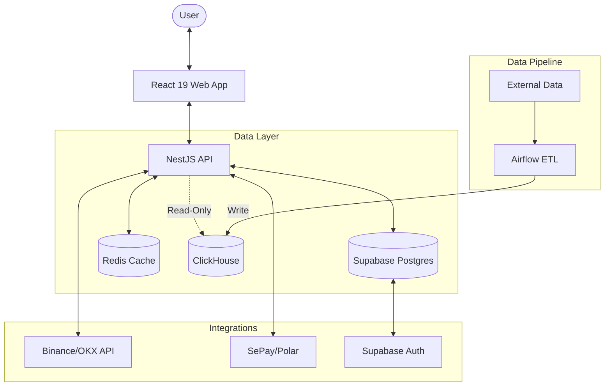

# Architecture Decision Document: fin-sight

_This document builds collaboratively through step-by-step discovery. Sections are appended as we work through each architectural decision together._

---

## Document Status

**Created:** 2025-12-26  
**Last Updated:** 2025-12-29  
**Status:** COMPLETE ✅  
**Project:** fin-sight v1.0 - Multi-Asset Portfolio Intelligence Platform

---

## Document Companion

**Architecture + Implementation Context:**

This architecture document focuses on **system design decisions, rationale, and integration patterns**. For **day-to-day implementation rules and coding conventions**, see [project-context.md](project-context.md), which provides:

- Quick-reference ALWAYS/NEVER patterns for TypeScript, React, Testing
- Technology-specific conventions (React Query, file-based routing, path aliases)
- Code quality rules (naming, organization, ESLint)
- Monorepo workflow commands and anti-patterns
- Critical gotchas that prevent common mistakes

**Read both documents together:**

- **architecture.md** = "What to build and why" (decisions, trade-offs, system design)
- **project-context.md** = "How to build it and what to avoid" (implementation rules, patterns)

**When to use each:**

- **Planning/design phase:** Read architecture.md for context and decisions
- **Implementation phase:** Keep project-context.md open for quick reference
- **Code review:** Check both for alignment with decisions and coding standards

---

## Project Context Analysis

### Requirements Overview

**Functional Requirements (Organized by Capability):**

The PRD defines comprehensive functional requirements across 12 capability areas:

1. **Authentication & User Management** - Supabase OAuth (Google/GitHub), email/password, profile management
2. **Portfolio Management** - Create/edit/delete portfolios, multi-currency support (VND/USD/USDT)
3. **Transaction Management** - Manual entry with autocomplete, keyboard shortcuts, transaction history
4. **Crypto Exchange Integration** - OAuth flow for Binance + OKX via CCXT, read-only access, real-time sync (5s target)
5. **Asset Price Data** - Multi-source ingestion (vnstock, yfinance, CoinGecko), staleness detection (>5 min badge)
6. **Technical Indicators** - RSI, MACD, MA from TradingView/3rd-party first, Airflow fallback when absent
7. **Portfolio Analytics** - Net worth calculation, allocation analysis, performance metrics (TWR/MWR)
8. **Currency Conversion** - Real-time FX rates, separation of asset gains vs currency gains
9. **Charts & Visualization** - TradingView widgets, lazy loading, reduced motion support
10. **Payments & Subscriptions** - SePay (VND) + Polar (USD), webhook verification, idempotency, reconciliation
11. **Notifications & Alerts** - Holdings snapshots, price alerts, Telegram integration (existing)
12. **Admin & Operations** - Reconciliation dashboard, audit log export, user management

**Non-Functional Requirements:**

- **Performance:** P95 API <200ms (cached), <500ms (analytics); TTI ≤2s; INP P75 ≤200ms; CLS ≤0.1
- **Reliability:** 99.9% uptime; payment processing ≥98% success; idempotent webhooks with retries
- **Security:** TLS/HSTS/CSP; Supabase OAuth/JWT; RBAC/RLS; secrets rotation; webhook signature verification
- **Privacy & Compliance:** PDPA/GDPR alignment; consent registry; data subject rights (export/delete/correct)
- **Accessibility:** WCAG 2.1 AA; keyboard navigation; ARIA landmarks; color contrast ≥4.5:1; reduced motion
- **Scalability:** Hundreds of users at launch; scalable to low thousands without architectural change

**Scale & Complexity:**

- **Primary domain:** Full-Stack SaaS Platform (React 19 + NestJS + Airflow + Multi-DB)
- **Complexity level:** HIGH
  - Multi-asset data normalization (VN stocks, US equities, crypto)
  - Multi-currency accounting with FX gain separation
  - Financial accuracy requirements (audit trails, versioned calculations)
  - Dual payment provider integration with reconciliation
  - Brownfield (Airflow/ClickHouse) + Greenfield (React/NestJS/Supabase) hybrid
- **Estimated architectural components:** 8 major components
  - Frontend: React 19 SPA with Enhanced Tabbed Navigation
  - Backend API: NestJS with caching layer
  - User Database: Supabase (PostgreSQL) for auth, portfolios, transactions
  - Analytics Warehouse: ClickHouse (extend existing schema)
  - ETL Pipeline: Airflow (extend with US equities + crypto DAGs)
  - Cache Layer: Upstash (Serverless Redis, 30s TTL for hot data)
  - Payment Integration: SePay + Polar webhooks
  - Crypto Integration: CCXT library for Binance + OKX

### Technical Constraints & Dependencies

**Brownfield Foundation (Must Integrate With):**

- Existing Apache Airflow 3.1.3 + CeleryExecutor ETL pipeline (production-ready, 87% test coverage)
- Existing ClickHouse data warehouse with `market_dwh.fact_stock_daily` and dimensional tables
- Existing Python 3.12 codebase with vnstock, pandas_ta for technical indicators
- Existing Telegram notification integration via Gemini API

**Technology Stack Constraints:**

- Frontend: React 19.2.3 (use latest features: useOptimistic, Actions), Vite 7.3.0, React Router 7.11.0
- Backend: NestJS (chosen for TypeScript consistency, decorator-based architecture)
- Auth: Supabase Auth + PostgreSQL (chosen for managed auth + RBAC/RLS)
- State: Zustand for global state (simpler than Redux, better TypeScript support)
- UI: Tailwind CSS 4.1.18, Radix UI primitives, Framer Motion 12.23.26
- Charts: TradingView widgets (primary), Recharts (fallback)

**External API Dependencies:**

- **Data Sources:** vnstock (VN stocks), yfinance/Polygon.io (US equities), CoinGecko/Binance API (crypto)
- **Technical Indicators:** TradingView/Polygon (primary), internal calculation (fallback)
- **Payment Providers:** SePay (VND, Vietnam market), Polar (USD, global)
- **Crypto Exchanges:** Binance + OKX (OAuth via CCXT library, read-only access)
- **AI:** Gemini API (existing integration for market insights)

**Data Strategy Constraints:**

- Star Schema required from Day 1 (dimensional modeling for drill-down lineage)
- Dual database strategy: Supabase Postgres (user data) + ClickHouse (analytics)
- Append-only event store for audit trails (portfolio mutations, payments)
- Calculation versioning (`calculation_version` field) for reproducibility

**Performance Constraints:**

- Polling-based refresh (no WebSockets in v1.0): Frontend 60s, Upstash TTL 30s
- Staleness detection threshold: >5 minutes triggers badge
- Launch scale: Hundreds of users, scalable to low thousands without re-architecture

### Cross-Cutting Concerns Identified

**1. Data Consistency Across Dual Databases**

- Challenge: User portfolios in Supabase Postgres, market data in ClickHouse
- Implication: API layer must orchestrate queries across both databases
- Pattern needed: Aggregation layer that joins user holdings with latest prices

**2. Cache Invalidation Strategy**

- Challenge: Upstash cache (30s TTL) must invalidate on portfolio mutations
- Implication: Write-through caching with explicit invalidation on transactions
- Pattern needed: Cache key design for user portfolios, asset prices, FX rates

**3. Multi-Currency Conversion & FX Gain Separation**

- Challenge: Cost basis in native currency (VND/USD/USDT), display in user's base currency
- Implication: FX rates table in ClickHouse, real-time conversion in API layer
- Pattern needed: Separate asset gains from currency gains in P&L calculations

**4. Financial Calculation Auditability**

- Challenge: Every calculation must be reproducible and transparent
- Implication: Versioned calculation logic, append-only event logs, drill-down lineage
- Pattern needed: Calculation engine with versioning, methodology documentation in UI

**5. Webhook Idempotency & Payment Reconciliation**

- Challenge: Dual payment providers (SePay + Polar) with async webhooks
- Implication: Signature verification, replay protection, idempotency keys, nightly reconciliation
- Pattern needed: Webhook handler with deduplication, retry queue, admin dashboard

**6. Multi-Asset Data Normalization**

- Challenge: VN stocks (T+2), US equities (T+0), crypto (instant) have different settlement
- Implication: Unified data model with asset-type-specific handling
- Pattern needed: `Dim_Asset` with SCD Type 2, `market_type` enum, exchange-specific logic

**7. Error Resilience & Graceful Degradation**

- Challenge: External APIs can fail (vnstock, yfinance, TradingView, Binance)
- Implication: Exponential backoff, staleness badges, fallback calculation for indicators
- Pattern needed: Circuit breaker pattern, retry strategies, user-visible error states

**8. Observability & Operational Monitoring**

- Challenge: Complex data flow across 4 systems (Airflow, ClickHouse, Supabase, Redis)
- Implication: Structured logging, distributed tracing, admin dashboards
- Pattern needed: Correlation IDs, RUM for frontend, reconciliation dashboards for payments

---

## Starter Template Evaluation

### Primary Technology Domain

**Full-Stack SaaS Platform** - Brownfield + Greenfield Hybrid

The project extends an existing production Apache Airflow + ClickHouse data pipeline (brownfield) with new React 19 web application and NestJS API (greenfield). This hybrid nature requires a tailored approach rather than a traditional starter template.

### Technical Preferences Established

**Development Approach:**

- Minimal NestJS setup (avoid opinionated boilerplates)
- Extend existing `apps/web/` React 19 + Vite setup as template
- Keep existing Turborepo + pnpm monorepo structure, add new packages
- Self-hosted Docker deployment (production: Supabase cloud only)

**Rationale:**

- Brownfield constraints: Must integrate with existing Airflow/ClickHouse infrastructure
- Team familiarity: Existing `apps/web/` already demonstrates React 19 patterns
- Deployment simplicity: Docker Compose for local dev, Docker containers for production
- Cost efficiency: Self-hosted reduces SaaS costs for compute-heavy analytics

### Selected Approach: Minimal CLI + Extend Existing

Rather than using opinionated starter templates, we'll initialize minimal projects and extend the existing brownfield foundation:

#### 1. NestJS API - Minimal Setup

**Initialization Command:**

```bash
# From project root
cd services/
nest new api --package-manager pnpm --skip-git

# Install essential dependencies
cd api/
pnpm add @nestjs/config @nestjs/swagger @nestjs/throttler
pnpm add @supabase/supabase-js @upstash/redis ccxt
pnpm add -D @types/node
```

**Architectural Decisions Provided by Minimal Setup:**

**Language & Runtime:**

- TypeScript 5.x (strict mode enabled)
- Node.js 20 LTS runtime
- ESM module system with CommonJS compatibility

**Project Structure:**

```
services/api/
├── src/
│   ├── main.ts              # Application entry point
│   ├── app.module.ts        # Root module
│   ├── app.controller.ts    # Health check endpoint
│   └── app.service.ts       # Core business logic
├── test/                    # E2E tests
├── tsconfig.json            # TypeScript config
├── nest-cli.json            # NestJS CLI config
└── package.json
```

**Build Tooling:**

- NestJS CLI build system (Webpack under the hood)
- TypeScript compilation with type checking
- Watch mode for development
- Production optimization and tree-shaking

**Development Experience:**

- Hot reload in development mode
- Built-in logging and exception handling
- Decorator-based dependency injection
- Environment variable configuration via @nestjs/config

**Additional Modules to Add:**

- Swagger/OpenAPI documentation (@nestjs/swagger)
- Rate limiting (@nestjs/throttler)
- Validation pipes (class-validator, class-transformer)
- Supabase client integration
- Upstash cache manager
- CCXT for crypto exchange integration

#### 2. React 19 Web App - Extend Existing

**Approach:** Use existing `apps/web/` as foundation and extend with new features

**Current State Analysis:**

- ✅ React 19.2.3 with latest features (useOptimistic, Actions)
- ✅ Vite 7.3.0 build system with SWC
- ✅ React Router 7.11.0 file-based routing
- ✅ Tailwind CSS 4.1.18 + Radix UI components
- ✅ Framer Motion 12.23.26 for animations
- ✅ Zustand store setup (portfolio-store.ts with mock data)
- ✅ Supabase client configuration
- ⚠️ Mock data only - needs API integration

**Extension Strategy:**

```bash
# No new initialization needed - extend existing app
cd apps/web/

# Add missing production dependencies
pnpm add react-query @tanstack/react-query  # API state management
pnpm add zod                                 # Schema validation
pnpm add date-fns-tz                        # Timezone handling
pnpm add recharts                           # Chart fallback
pnpm add -D vitest @vitest/ui               # Unit testing
pnpm add -D @playwright/test                # E2E testing
```

**Architectural Decisions Already Made:**

- Component architecture: Atomic design pattern (atoms, molecules, organisms)
- Routing: File-based with React Router 7 (`routes/` directory)
- State: Zustand for global state, React Query for server state (to add)
- Styling: Tailwind utility-first with Radix UI primitives
- Forms: React Hook Form with Zod validation (to add)
- Animation: Framer Motion for micro-interactions
- Charts: TradingView widgets (primary), Recharts (fallback)

**Directory Structure Extensions:**

```
apps/web/src/
├── api/                     # NEW: API client layer
│   ├── client.ts           # Axios/Fetch wrapper
│   ├── endpoints/          # Typed API endpoints
│   └── hooks/              # React Query hooks
├── components/             # Existing UI components
├── routes/                 # Existing file-based routes
├── stores/                 # Existing Zustand stores
├── lib/                    # Existing utilities
├── hooks/                  # NEW: Custom React hooks
├── types/                  # NEW: Shared TypeScript types
└── utils/                  # NEW: Helper functions
```

#### 3. Shared Packages - Extend Monorepo

**New Packages to Create:**

```bash
# From project root
mkdir -p packages/api-types packages/config

# Shared Database Types (Type Safety Foundation)
cd packages/database-types/
pnpm init
# Script: "gen": "supabase gen types typescript --local > src/database.types.ts"

# Shared TypeScript types (DTOs + Enums)
cd packages/api-types/
pnpm init
# Exports shared DTOs and re-exports Database definitions
# Dependencies: packages/database-types

# Shared configuration
cd packages/config/
pnpm init
# Add shared constants, enums, validation schemas
```

**Monorepo Structure After Extensions:**

```
fin-sight/
├── apps/
│   └── web/                    # Existing React 19 app (extend)
├── services/
│   ├── data-pipeline/          # Existing Airflow pipeline (extend DAGs)
│   └── api/                    # NEW: NestJS API
├── packages/
│   ├── ui/                     # Existing shared React components
│   ├── eslint-config/          # Existing shared ESLint config
│   ├── typescript-config/      # Existing shared TS config
│   ├── api-types/              # NEW: Shared API types
│   └── config/                 # NEW: Shared config/constants
├── supabase/                   # Existing Supabase config
├── turbo.json                  # Existing Turborepo config
├── pnpm-workspace.yaml         # Existing workspace config
└── package.json                # Existing root package.json
```

> [!IMPORTANT]
> **Shared Packages Must Be Framework-Agnostic**
>
> Packages under `packages/` are imported by BOTH frontend (`apps/web`) and backend (`services/api`). They MUST NOT contain framework-specific dependencies.
>
> **Allowed Dependencies:**
>
> - ✅ Plain TypeScript (classes, interfaces, enums, types)
> - ✅ Framework-agnostic validators (`class-validator`, `zod`)
> - ✅ Utility libraries that work in both Node.js and browser (`date-fns`, `lodash`)
>
> **Prohibited Dependencies:**
>
> - ❌ `@nestjs/*` packages (backend-only)
> - ❌ React-specific packages (frontend-only)
> - ❌ Node.js-only packages (`fs`, `path`, etc.)
> - ❌ Browser-only APIs
>
> **For API Documentation:** Apply `@nestjs/swagger` decorators in backend controllers/services, NOT in shared DTOs. The plain TypeScript classes from shared packages can be referenced in `@ApiResponse({ type: SomeDto })` without needing decorators on the DTO itself.
>
> **Example Violation Found (2025-12-28):**
>
> - `packages/api-types/src/connection.dto.ts` incorrectly imported `@nestjs/swagger`
> - **Fix:** Removed all `@ApiProperty` decorators, kept only `class-validator` decorators
> - **Result:** Frontend can now safely import DTOs without bundling NestJS code

#### 4. Docker Deployment - Self-Hosted Strategy

**Docker Compose for Development:**

```yaml
# docker-compose.yml (extend existing services/data-pipeline/docker-compose.yaml)
version: "3.8"

services:
  # Existing services (keep all)
  postgres:
    image: postgres:16
  clickhouse-server:
    image: clickhouse/clickhouse-server:latest
  redis:
    image: redis:7.2-alpine
  airflow-webserver:
    build: ./services/data-pipeline
  airflow-scheduler:
    build: ./services/data-pipeline
  airflow-worker:
    build: ./services/data-pipeline
  flower:
    build: ./services/data-pipeline

  # NEW: NestJS API
  api:
    build: ./services/api
    ports:
      - "3000:3000"
    environment:
      - NODE_ENV=development
      - DATABASE_URL=${DATABASE_URL}
      - UPSTASH_REDIS_REST_URL=${UPSTASH_REDIS_REST_URL}
      - UPSTASH_REDIS_REST_TOKEN=${UPSTASH_REDIS_REST_TOKEN}
      - CLICKHOUSE_HOST=clickhouse-server
      - SUPABASE_URL=${SUPABASE_URL}
      - SUPABASE_ANON_KEY=${SUPABASE_ANON_KEY}
    depends_on:
      - postgres
      - clickhouse-server
    volumes:
      - ./services/api/src:/app/src
    command: pnpm run start:dev

  # NEW: React Web App (dev server)
  web:
    build: ./apps/web
    ports:
      - "5173:5173"
    environment:
      - VITE_API_URL=http://localhost:3000
      - VITE_SUPABASE_URL=${VITE_SUPABASE_URL}
      - VITE_SUPABASE_ANON_KEY=${VITE_SUPABASE_ANON_KEY}
    volumes:
      - ./apps/web/src:/app/src
    command: pnpm run dev
```

**Production Deployment Strategy:**

- **Supabase Cloud:** Production PostgreSQL database with auth (managed service)
- **Self-Hosted Containers:**
  - NestJS API (Docker container on VPS/cloud VM)
  - React SPA (static build served via Nginx container)
  - ClickHouse (Docker container or managed ClickHouse Cloud)
  - Redis (Docker container or managed Redis)
  - Airflow (existing Docker Compose setup)

**Dockerfile for NestJS API:**

```dockerfile
# services/api/Dockerfile
FROM node:20-alpine AS builder

WORKDIR /app
COPY package*.json ./
COPY pnpm-lock.yaml ./
RUN npm install -g pnpm
RUN pnpm install --frozen-lockfile

COPY . .
RUN pnpm run build

FROM node:20-alpine AS runner
WORKDIR /app
COPY --from=builder /app/dist ./dist
COPY --from=builder /app/node_modules ./node_modules
COPY package*.json ./

EXPOSE 3000
CMD ["node", "dist/main.js"]
```

**Dockerfile for React Web:**

```dockerfile
# apps/web/Dockerfile
FROM node:20-alpine AS builder

WORKDIR /app
COPY package*.json ./
COPY pnpm-lock.yaml ./
RUN npm install -g pnpm
RUN pnpm install --frozen-lockfile

COPY . .
RUN pnpm run build

FROM nginx:alpine
COPY --from=builder /app/dist /usr/share/nginx/html
COPY nginx.conf /etc/nginx/conf.d/default.conf
EXPOSE 80
CMD ["nginx", "-g", "daemon off;"]
```

### Architectural Decisions Summary

**Initialization Sequence:**

1. **NestJS API:** `nest new api --package-manager pnpm --skip-git` in `services/` directory
2. **React Web:** Extend existing `apps/web/` with API integration and testing
3. **Shared Packages:** Create `packages/api-types/` and `packages/config/` manually
4. **Docker Setup:** Extend existing `docker-compose.yaml` with new services

**Technology Stack Finalized:**

- **Frontend:** React 19 + Vite + React Router 7 + Tailwind + Zustand + React Query
- **Backend:** NestJS + TypeScript + Supabase Client + Upstash Redis SDK + CCXT
- **Data Pipeline:** Apache Airflow + Python 3.12 (existing, extend with US/crypto DAGs)
- **Databases:** Supabase Postgres (users/portfolios) + ClickHouse (analytics) + Upstash (cache)
- **Frontend:** React 19 + Vite + React Router 7 + Tailwind + Zustand + React Query
- **Backend:** NestJS + TypeScript + Supabase Client + Upstash SDK + CCXT
- **Data Pipeline:** Apache Airflow + Python 3.12 (existing, extend with US/crypto DAGs)
- **Databases:** Supabase Postgres (users/portfolios) + ClickHouse (analytics) + Upstash (cache)
- **Deployment:** Docker Compose (dev) + Docker containers (production, self-hosted)
- **Monorepo:** Turborepo + pnpm workspaces (existing structure maintained)

**Key Architectural Patterns Established:**

- **API Gateway Pattern:** NestJS API orchestrates between Supabase, ClickHouse, and Upstash
- **Backend for Frontend (BFF):** API layer tailored for React web app needs
- **Cache-Aside Pattern:** Upstash caching with explicit invalidation
- **Repository Pattern:** NestJS services abstract database access
- **Brownfield Extension:** New greenfield components integrate with existing Airflow/ClickHouse

**Note:** Project initialization steps should be the first implementation stories in Epic 1.

---

## Core Architectural Decisions

### Decision Priority Analysis

**Critical Decisions (Block Implementation):**

- ✅ Supabase Postgres schema pattern (Hybrid: normalized + materialized views)
- ✅ Data synchronization strategy (API-layer aggregation, no sync)
- ✅ Cache invalidation approach (Write-through with explicit invalidation)
- ✅ API design pattern (RESTful API)
- ✅ Server state management (React Query)

**Important Decisions (Shape Architecture):**

- ✅ API documentation (OpenAPI/Swagger)
- ✅ Error handling strategy (Retry with exponential backoff)
- ✅ Logging approach (Structured JSON)
- ✅ Testing strategy for MVP (E2E critical paths only)

**Deferred Decisions (Post-MVP):**

- Circuit breaker pattern for external API failures
- Fallback data strategies for technical indicators
- Comprehensive unit test coverage
- Advanced caching strategies (cache pre-aggregation)

---

### Data Architecture

#### Decision 1.1: Supabase Postgres Schema Pattern

**Choice:** Hybrid Approach (Normalized + Materialized Views)

**Rationale:**

- Financial transactions require data integrity (normalized base tables)
- Dashboard reads need performance (materialized views for aggregations)
- Leverages Postgres strengths: ACID compliance + view refresh capabilities

**Implementation Details:**

```sql
-- Normalized base tables
CREATE TABLE users (id, email, created_at, ...);
CREATE TABLE portfolios (id, user_id, name, base_currency, ...);
CREATE TABLE accounts (id, portfolio_id, account_type, platform, ...);
CREATE TABLE transactions (id, account_id, asset_id, type, quantity, price, ...);

-- Materialized views for performance
CREATE MATERIALIZED VIEW portfolio_summary AS
  SELECT
    p.id AS portfolio_id,
    p.user_id,
    COUNT(DISTINCT t.asset_id) AS asset_count,
    SUM(t.quantity * latest_price) AS total_value
  FROM portfolios p
  JOIN accounts a ON p.id = a.portfolio_id
  JOIN transactions t ON a.id = t.account_id
  GROUP BY p.id, p.user_id;

-- Refresh strategy: On-demand via API or scheduled
REFRESH MATERIALIZED VIEW CONCURRENTLY portfolio_summary;
```

**Affects:** Backend API data access layer, Supabase migrations, portfolio analytics queries

---

#### Decision 1.2: Data Synchronization Strategy

**Choice:** API-Layer Aggregation (No Database Sync)

**Rationale:**

- Simplest implementation for MVP
- Leverages Upstash caching (30s TTL as specified in PRD)
- Avoids data duplication and sync complexity
- Aligns with polling-based architecture

**Implementation Pattern:**

```typescript
// NestJS service example
async getPortfolioValuation(portfolioId: string) {
  // 1. Check Upstash cache
  const cached = await this.cache.get(`portfolio:${portfolioId}:valuation`);
  if (cached) return JSON.parse(cached);

  // 2. Query Supabase for user holdings
  const holdings = await this.supabase
    .from('transactions')
    .select('asset_id, quantity, avg_cost')
    .eq('portfolio_id', portfolioId);

  // 3. Query ClickHouse for latest prices
  const prices = await this.clickhouse.query(`
    SELECT ticker, close, rsi_14, macd
    FROM market_dwh.fact_stock_daily
    WHERE trading_date = today()
    AND ticker IN (${holdings.map(h => h.asset_id)})
  `);

  // 4. Aggregate in-memory
  const valuation = this.calculateValuation(holdings, prices);

  // 5. Cache result (30s TTL)
  await this.cache.set(
    `portfolio:${portfolioId}:valuation`,
    valuation,
    { ex: 30 }
  );

  return valuation;
}
```

**Affects:** NestJS portfolio service, Upstash cache configuration, API response times

**Future Enhancement (Post-MVP):** Add nightly Airflow DAG to pre-calculate historical portfolio snapshots in ClickHouse for faster historical analysis.

---

#### Decision 1.3: Cache Invalidation Strategy

**Choice:** Write-Through with Explicit Invalidation

**Rationale:**

- Users expect immediate reflection of transaction changes
- Aligns with transparent calculations requirement
- Cache key pattern enables granular invalidation

**Cache Key Design:**

```
portfolio:{userId}:{portfolioId}:summary      # Portfolio summary
portfolio:{userId}:{portfolioId}:holdings     # Holdings breakdown
portfolio:{userId}:{portfolioId}:transactions # Transaction history
asset:{ticker}:price                          # Latest price per asset
fx:rates:{date}                               # FX rates per day
```

**Invalidation Logic:**

```typescript
// On transaction create/update/delete
async invalidatePortfolioCache(userId: string, portfolioId: string) {
  const keys = [
    `portfolio:${userId}:${portfolioId}:summary`,
    `portfolio:${userId}:${portfolioId}:holdings`,
    `portfolio:${userId}:${portfolioId}:transactions`,
  ];
  await this.cache.del(...keys);
}
```

**Affects:** NestJS transaction service, Upstash cache manager, API mutations

---

### API Design & Communication

#### Decision 2.1: API Design Pattern

**Choice:** RESTful API

**Rationale:**

- Simple, widely understood, great tooling
- Aligns with NestJS controller patterns
- Sufficient for MVP dashboard requirements
- Cacheable HTTP GET requests

**Endpoint Structure:**

```
# Authentication
POST   /auth/signup
POST   /auth/login
POST   /auth/logout

# Portfolios
GET    /portfolios
POST   /portfolios
GET    /portfolios/:id
PATCH  /portfolios/:id
DELETE /portfolios/:id
GET    /portfolios/:id/summary          # Aggregation endpoint
GET    /portfolios/:id/holdings         # Holdings for specific portfolio

# Transactions
GET    /portfolios/:id/transactions
POST   /portfolios/:id/transactions
GET    /portfolios/:id/transactions/:transactionId
PATCH  /portfolios/:id/transactions/:transactionId
DELETE /portfolios/:id/transactions/:transactionId

# Assets (read-only, from ClickHouse)
GET    /assets/search?q=AAPL
GET    /assets/:ticker
GET    /assets/:ticker/prices?from=2024-01-01&to=2024-12-31
GET    /assets/:ticker/indicators

# Crypto Exchange Integration
GET    /exchanges/available              # List Binance, OKX
POST   /exchanges/connect                # OAuth flow initiation
GET    /exchanges/:exchangeId/balances   # Fetch holdings
DELETE /exchanges/:exchangeId            # Disconnect

# Payments (webhooks)
POST   /webhooks/sepay
POST   /webhooks/polar

# Admin
GET    /admin/reconciliation             # Payment reconciliation dashboard
GET    /admin/audit-logs                 # Audit trail export
```

**Affects:** NestJS controller structure, frontend API client, Swagger documentation

---

#### Decision 2.2: API Documentation

**Choice:** OpenAPI/Swagger via @nestjs/swagger

**Rationale:**

- Auto-generated from decorators (stays in sync)
- Interactive UI for testing endpoints
- Type-safe client generation for frontend
- Minimal effort with NestJS

**Implementation:**

```typescript
// NestJS setup (main.ts)
const config = new DocumentBuilder()
  .setTitle("Fin-Sight API")
  .setDescription("Multi-asset portfolio tracking API")
  .setVersion("1.0")
  .addBearerAuth()
  .build();
const document = SwaggerModule.createDocument(app, config);
SwaggerModule.setup("api/docs", app, document);

// Controller example with decorators
@ApiTags("portfolios")
@ApiBearerAuth()
@Controller("portfolios")
export class PortfoliosController {
  @Get(":id/summary")
  @ApiOperation({ summary: "Get portfolio summary with allocations" })
  @ApiResponse({ status: 200, type: PortfolioSummaryDto })
  async getSummary(@Param("id") id: string) {
    return this.portfoliosService.getSummary(id);
  }
}
```

**Access:** http://localhost:3000/api/docs (Swagger UI)

**Affects:** NestJS controllers (add decorators), frontend API client generation

---

### Frontend Architecture

#### Decision 3.1: Server State Management

**Choice:** React Query (@tanstack/react-query)

**Rationale:**

- Purpose-built for server state (API data)
- Built-in caching, refetching, polling (matches 60s requirement)
- Perfect for optimistic updates with React 19's useOptimistic
- Automatic cache invalidation on mutations

**Implementation:**

```typescript
// Query setup (App.tsx)
import { QueryClient, QueryClientProvider } from '@tanstack/react-query';

const queryClient = new QueryClient({
  defaultOptions: {
    queries: {
      staleTime: 30 * 1000,        // Match Upstash TTL
      refetchInterval: 60 * 1000,  // 60s polling as per PRD
      retry: 3,                     // Exponential backoff
    },
  },
});

// Custom hook example
export function usePortfolioSummary(portfolioId: string) {
  return useQuery({
    queryKey: ['portfolio', portfolioId, 'summary'],
    queryFn: () => api.getPortfolioSummary(portfolioId),
    staleTime: 30 * 1000,
  });
}

// Mutation with cache invalidation
export function useAddTransaction(portfolioId: string) {
  const queryClient = useQueryClient();

  return useMutation({
    mutationFn: (data) => api.addTransaction(portfolioId, data),
    onSuccess: () => {
      // Invalidate portfolio cache
      queryClient.invalidateQueries(['portfolio', portfolioId]);
    },
  });
}

// Optimistic update with React 19
function TransactionForm({ portfolioId }) {
  const [optimisticTransactions, addOptimistic] = useOptimistic(
    transactions,
    (state, newTx) => [...state, newTx]
  );

  const mutation = useAddTransaction(portfolioId);

  async function handleSubmit(data) {
    addOptimistic({ ...data, id: 'pending' });
    await mutation.mutateAsync(data);
  }

  return <form onSubmit={handleSubmit}>...</form>;
}
```

**Affects:** Frontend API integration, loading states, cache management, optimistic updates

**Zustand Use Case:** Keep Zustand for UI-only state (theme, modal visibility, sidebar state)

---

#### Decision 3.2: Frontend Route Architecture

**Choice:** Portfolio-First Navigation with Drill-Down

**Rationale:**

- Users manage multiple portfolios (e.g., "Personal Wealth", "Family Trust", "Trading Bot")
- Dashboard should show portfolio overview first, then drill into portfolio detail
- Aligns with PRD requirement: ≤ 3 clicks from dashboard → portfolio → asset → transaction

**Route Structure:**

```
/                           # Redirect to /dashboard
/login                      # Authentication
/signup                     # Registration

/dashboard                  # Portfolio List (cards with summary)
                           # Shows: Portfolio name, Net Worth, P/L, allocation mini-chart
                           # Click card → navigates to /portfolio/:id

/portfolio/:id              # Portfolio Detail (Holdings + Analytics)
                           # Shows: Net Worth chart, Allocation donut, Holdings table
                           # Holdings table has asset-class filter (All/VN/US/Crypto)
                           # Click row → expands methodology panel (Story 2.5)
                           # Click asset → navigates to /portfolio/:id/asset/:symbol

/portfolio/:id/asset/:symbol  # Asset Detail (Transactions + Chart)
                           # Shows: TradingView chart, Transaction history, P/L breakdown

/settings                   # User settings
/settings/connections       # Exchange API connections (Binance, OKX)
```

**Navigation Flow:**

```
┌─────────────────────────────────────────────────────────────────┐
│ /dashboard                                                       │
│ ┌──────────────┐ ┌──────────────┐ ┌──────────────┐              │
│ │ Personal     │ │ Family       │ │ + Create     │              │
│ │ Wealth       │ │ Trust        │ │ Portfolio    │              │
│ │ $65,450      │ │ ₫500M        │ │              │              │
│ │ +5.5% YTD    │ │ -2.3% YTD    │ │              │              │
│ └──────┬───────┘ └──────────────┘ └──────────────┘              │
│        │ Click (1)                                               │
│        ▼                                                         │
├─────────────────────────────────────────────────────────────────┤
│ /portfolio/:id                                                   │
│ ┌─────────────────────────────────────────────────────────────┐ │
│ │ Personal Wealth | $65,450 | +$3,450 (+5.5%)                 │ │
│ ├─────────────────────────────────────────────────────────────┤ │
│ │ [All] [VN] [US] [Crypto]  ← Asset Class Filters             │ │
│ │ ▶ AAPL | US Equity | $150 | +2.3% | $15,000                 │ │
│ │   └─ MethodologyPanel (cost basis, data source) ← Click (2) │ │
│ └─────────────────────────────────────────────────────────────┘ │
│        │ Click asset row (3)                                     │
│        ▼                                                         │
├─────────────────────────────────────────────────────────────────┤
│ /portfolio/:id/asset/:symbol                                     │
│ ┌─────────────────────────────────────────────────────────────┐ │
│ │ AAPL - Apple Inc. | TradingView Chart                       │ │
│ │ Transaction History | P/L Breakdown                         │ │
│ └─────────────────────────────────────────────────────────────┘ │
└─────────────────────────────────────────────────────────────────┘
```

**Affects:** React Router configuration, DashboardPage component, navigation state

---

### Error Handling & Resilience

#### Decision 4.1: Error Handling Strategy

**Choice:** Simple Retry with Exponential Backoff

**Rationale:**

- Handles transient network failures
- Simple to implement
- React Query provides built-in retry logic
- Sufficient for MVP, add circuit breaker post-MVP

**Retry Configuration:**

```typescript
// React Query (frontend)
const queryClient = new QueryClient({
  defaultOptions: {
    queries: {
      retry: 3,
      retryDelay: (attemptIndex) => Math.min(1000 * 2 ** attemptIndex, 30000),
      // 1s, 2s, 4s, max 30s
    },
  },
});

// NestJS (backend API to external services)
import { retry } from 'rxjs/operators';

async fetchFromExternalAPI(url: string) {
  return this.httpService.get(url).pipe(
    retry({
      count: 3,
      delay: (error, retryCount) => timer(1000 * 2 ** retryCount),
    })
  ).toPromise();
}
```

**Error States to Handle:**

- Network timeout → Retry with backoff
- API rate limit (429) → Retry with exponential backoff
- Server error (500) → Retry, then show error message
- Client error (400) → No retry, show validation error

**Future Enhancement (Post-MVP):**

- Circuit breaker for external APIs (vnstock, yfinance, Binance)
- Fallback to cached/stale data with staleness badge (>5 min)
- Fallback to internal indicator calculation when TradingView unavailable

**Affects:** API client configuration, error boundary components, user error messaging

---

### Observability & Monitoring

#### Decision 5.1: Logging Strategy

**Choice:** Structured JSON Logging with Correlation IDs

**Rationale:**

- Machine-parseable for querying and alerting
- Correlation IDs trace requests across services (Airflow → ClickHouse → NestJS → React)
- Essential for debugging distributed systems

**Implementation:**

```typescript
// NestJS with Winston
import { WinstonModule } from "nest-winston";
import * as winston from "winston";

const logger = WinstonModule.createLogger({
  format: winston.format.combine(
    winston.format.timestamp(),
    winston.format.json(),
  ),
  transports: [
    new winston.transports.Console(),
    new winston.transports.File({ filename: "logs/app.log" }),
  ],
});

// Middleware to add correlation ID
app.use((req, res, next) => {
  req.correlationId = req.headers["x-correlation-id"] || uuidv4();
  res.setHeader("x-correlation-id", req.correlationId);
  next();
});

// Logging with context
this.logger.log({
  level: "info",
  message: "Portfolio valuation calculated",
  correlationId: req.correlationId,
  userId: user.id,
  portfolioId: portfolio.id,
  duration: Date.now() - startTime,
});
```

**Log Levels:**

- `error`: API failures, database errors, webhook failures
- `warn`: Retry attempts, stale cache, rate limits
- `info`: User actions (transaction added), API calls, cache hits/misses
- `debug`: Detailed flow for development

**Affects:** NestJS logger setup, middleware, service logging, operational debugging

---

### Testing Strategy

#### Decision 6.1: Testing Approach for MVP

**Choice:** E2E Critical Paths Only (Playwright)

**Rationale:**

- Fast MVP delivery (6-8 week timeline)
- Tests what matters to users (journeys, not units)
- Playwright already in PRD requirements
- Add unit/integration tests post-MVP during refactoring

**Critical E2E Test Scenarios:**

```typescript
// tests/e2e/critical-flows.spec.ts

test("User journey: Signup → Add transaction → View portfolio", async ({
  page,
}) => {
  // 1. Signup
  await page.goto("/signup");
  await page.fill("[name=email]", "test@example.com");
  await page.fill("[name=password]", "SecurePass123!");
  await page.click("button[type=submit]");
  await expect(page).toHaveURL("/");

  // 2. Create portfolio
  await page.click("text=Create Portfolio");
  await page.fill("[name=name]", "My Portfolio");
  await page.selectOption("[name=currency]", "USD");
  await page.click('button:has-text("Create")');

  // 3. Add transaction
  await page.click("text=Add Transaction");
  await page.fill("[name=ticker]", "AAPL");
  await page.fill("[name=quantity]", "10");
  await page.fill("[name=price]", "150");
  await page.click('button:has-text("Add")');

  // 4. Verify portfolio shows transaction
  await expect(page.locator("text=AAPL")).toBeVisible();
  await expect(page.locator("text=$1,500")).toBeVisible(); // 10 * 150
});

test("User journey: Connect Binance → Sync holdings", async ({ page }) => {
  await page.goto("/settings");
  await page.click("text=Connect Binance");

  // OAuth flow (mock in test)
  await page.waitForURL("**/exchanges/binance/callback**");

  // Verify holdings synced
  await expect(page.locator("text=Bitcoin (BTC)")).toBeVisible();
  await expect(page.locator("[data-testid=sync-badge]")).toHaveText("Synced");
});

test("User journey: Upgrade to paid tier", async ({ page }) => {
  // Hit free tier limit
  for (let i = 0; i < 20; i++) {
    await addTransaction(page, `STOCK${i}`, 1, 100);
  }

  // Upgrade modal appears
  await expect(page.locator("text=Upgrade to Pro")).toBeVisible();
  await page.click('button:has-text("Upgrade")');

  // Payment flow (mock webhook)
  await page.selectOption("[name=currency]", "USD");
  await page.click('button:has-text("Pay with Polar")');

  // Verify tier upgraded
  await expect(page.locator("text=Pro Plan")).toBeVisible();
});

test("Error recovery: Stale price data shows badge", async ({ page }) => {
  // Mock API to return stale timestamp
  await page.route("**/api/assets/AAPL", (route) => {
    route.fulfill({
      json: {
        ticker: "AAPL",
        price: 150,
        updated_at: new Date(Date.now() - 6 * 60 * 1000), // 6 min ago
      },
    });
  });

  await page.goto("/portfolio/123");
  await expect(page.locator("[data-testid=staleness-badge]")).toBeVisible();
});
```

**Test Matrix (Per PRD):**

- Desktop: Chrome, Firefox, Safari (latest)
- Mobile: iOS Safari, Android Chrome (latest)

**CI Integration:**

```yaml
# .github/workflows/e2e-tests.yml
name: E2E Tests
on: [push, pull_request]
jobs:
  test:
    runs-on: ubuntu-latest
    steps:
      - uses: actions/checkout@v3
      - uses: actions/setup-node@v3
      - run: pnpm install
      - run: pnpm run build
      - run: pnpm run test:e2e
```

**Deferred (Post-MVP):**

- Unit tests for business logic (portfolio calculations, cost basis)
- Integration tests for API endpoints
- Visual regression tests for UI components

**Affects:** Testing infrastructure, CI/CD pipeline, development workflow

---

### Decision Impact Analysis

**Implementation Sequence (Recommended Order):**

1.  **Foundation Layer**
    - NestJS project initialization with minimal setup
    - Structured logging (Winston) + correlation ID middleware
    - Swagger/OpenAPI setup

2.  **Data Layer**
    - Supabase schema (normalized tables + materialized views)
    - ClickHouse schema extensions (market_type enum, FX rates table)
    - Upstash cache configuration

3.  **API Layer**
    - RESTful endpoints (portfolios, transactions, assets)
    - API-layer aggregation logic (Supabase + ClickHouse queries)
    - Write-through cache invalidation

4.  **Frontend Integration**
    - React Query setup with polling (60s)
    - API client with retry logic
    - Optimistic updates with useOptimistic

5.  **External Integrations**
    - Crypto exchange OAuth (CCXT library for Binance/OKX)
    - Payment webhooks (SePay + Polar)

6.  **Testing & Observability**
    - Playwright E2E tests for critical paths
    - Monitoring dashboards (optional for MVP)

**Cross-Component Dependencies:**

- **Cache Invalidation** depends on **API Layer** completion
- **Frontend React Query** depends on **API Layer** REST endpoints
- **E2E Tests** depend on **Frontend + API + Data Layer** integration
- **Crypto Integration** depends on **API Layer** + **Data Layer** (accounts table)
- **Payment Webhooks** depend on **API Layer** + **Observability** (audit logs)

**Risk Mitigation:**

- **Data sync complexity:** Avoided by choosing API-layer aggregation
- **Cache consistency:** Mitigated by write-through invalidation pattern
- **External API failures:** Handled by retry with exponential backoff
- **Testing bottleneck:** Focused on E2E critical paths only for MVP speed

---

## Implementation Patterns & Consistency Rules

_For detailed implementation rules and coding conventions, see [project-context.md](project-context.md). This section focuses on high-level patterns and architectural rationale._

### Pattern Categories Defined

**Critical Conflict Points Identified:** 15+ areas where developers could make inconsistent choices

**Resolution:** Comprehensive naming, structure, format, and communication patterns defined to ensure AI agents and developers produce consistent code across the brownfield + greenfield hybrid architecture.

**Implementation Note:** Day-to-day coding rules (ALWAYS/NEVER patterns) are maintained in [project-context.md](project-context.md) for quick reference. This section documents the architectural reasoning behind those rules.

---

### Naming Patterns

#### Architectural Rationale

**Multi-Layer Consistency Challenge:**

- Database layer (Postgres + ClickHouse) uses snake_case
- API layer (NestJS) uses TypeScript camelCase
- Frontend layer (React) uses JavaScript camelCase
- HTTP layer (REST) uses kebab-case URLs

**Solution:** Clear boundaries with transformation at each layer:

1. Database → API: Transform snake_case to camelCase in services
2. API → HTTP: URL paths use kebab-case, JSON bodies use camelCase
3. Frontend → API: Consistent camelCase in React components

**Detailed Rules:** See [project-context.md](project-context.md) sections:

- TypeScript Configuration & Patterns
- React 19 + React Router 7 Patterns
- Code Quality & API Patterns

#### Database Schema Examples

**Standard:** snake_case for all identifiers (Supabase/ClickHouse convention)

```sql
-- Tables: plural, snake_case
CREATE TABLE portfolios (
  portfolio_id UUID PRIMARY KEY,
  user_id UUID REFERENCES users(id),
  portfolio_name TEXT NOT NULL,
  base_currency TEXT NOT NULL
);

-- Indexes: idx_{table}_{columns}
CREATE INDEX idx_portfolios_user_id ON portfolios(user_id);
```

#### API Contract Examples

**RESTful Endpoints:** Plural resources, kebab-case for multi-word

```
GET    /portfolios
POST   /portfolios
GET    /portfolios/:id/transactions
GET    /crypto-exchanges            # kebab-case
GET    /assets/search?ticker_symbol=AAPL  # snake_case query params
```

**JSON Response Format:** camelCase fields, always wrapped

```typescript
// Success
{
  "data": {
    "portfolioId": "uuid",
    "portfolioName": "My Portfolio",
    "totalValue": 15000.50,
    "createdAt": "2025-12-26T10:30:00Z"
  },
  "meta": { "timestamp": "2025-12-26T10:30:15Z" }
}

// Error (NestJS standard)
{
  "statusCode": 400,
  "message": "Validation failed",
  "error": "Bad Request"
}
```

**Rationale:** Plural resources (RESTful), snake_case query params (URL convention), camelCase JSON (JavaScript convention), wrapped responses (predictable parsing)

**Detailed API patterns:** See [project-context.md](project-context.md) Code Quality & API Patterns section

---

#### API Contract Examples

**RESTful Endpoints:** Plural resources, kebab-case for multi-word

```
GET    /portfolios
POST   /portfolios
GET    /portfolios/:id/transactions
GET    /crypto-exchanges            # kebab-case
GET    /assets/search?ticker_symbol=AAPL  # snake_case query params
```

**JSON Response Format:** camelCase fields, always wrapped

```typescript
// Success
{
  "data": {
    "portfolioId": "uuid",
    "portfolioName": "My Portfolio",
    "totalValue": 15000.50,
    "createdAt": "2025-12-26T10:30:00Z"
  },
  "meta": { "timestamp": "2025-12-26T10:30:15Z" }
}

// Error (NestJS standard)
{
  "statusCode": 400,
  "message": "Validation failed",
  "error": "Bad Request"
}
```

**Rationale:** Plural resources (RESTful), snake_case query params (URL convention), camelCase JSON (JavaScript convention), wrapped responses (predictable parsing)

**Detailed API patterns:** See [project-context.md](project-context.md) Code Quality & API Patterns section

---

### Structure Patterns

#### Architectural Organization Principles

**Feature-Based Organization:** Code organized by business capability, not technical layer

**Rationale:**

- Easier to locate related code (all portfolio code in one place)
- Scales better with team growth (teams can own features)
- Reduces coupling between features
- Co-located tests improve maintainability

**Frontend Structure (React):**

```
apps/web/src/
├── features/           # Feature-based (portfolio/, transactions/, analytics/)
├── components/         # Shared UI components
├── api/hooks/          # React Query hooks
├── routes/             # File-based routing (React Router 7)
└── lib/                # Utilities
```

**Backend Structure (NestJS):**

```
services/api/src/
├── portfolios/         # Feature module (module, controller, service, DTOs)
├── transactions/       # Feature module
├── crypto/             # Feature module
└── common/             # Shared utilities, guards, interceptors
```

**Test Organization:** Co-located with source files

- Unit tests: `portfolio.service.spec.ts` next to `portfolio.service.ts`
- Component tests: `portfolio-card.test.tsx` next to `portfolio-card.tsx`
- E2E tests: Separate `tests/e2e/` directory

**Detailed structure:** See Complete Directory Structure section below and [project-context.md](project-context.md)

---

│ ├── assets.service.ts
│ └── providers/ # External data sources
│ ├── clickhouse.provider.ts
│ ├── vnstock.provider.ts
│ └── yfinance.provider.ts
│
├── crypto/
│ ├── crypto.module.ts
│ ├── crypto.service.ts
│ ├── exchanges/
│ │ ├── binance.service.ts
│ │ └── okx.service.ts
│ └── dto/
│
├── payments/
│ ├── payments.module.ts
│ ├── payments.service.ts
│ ├── webhooks/
│ │ ├── sepay.controller.ts
│ │ └── polar.controller.ts
│ └── dto/
│
├── common/ # Shared utilities
│ ├── decorators/
│ ├── filters/ # Exception filters
│ ├── guards/ # Auth guards
│ ├── interceptors/ # Logging, transform
│ ├── pipes/ # Validation pipes
│ └── utils/
│
├── config/ # Configuration
│ ├── database.config.ts
│ ├── cache.config.ts # Upstash configuration
│ └── supabase.config.ts
│
└── main.ts # Application entry point

```

**Test Location:** Co-located with source files

```

# Unit tests: same directory as source

portfolio.service.ts
portfolio.service.spec.ts # NestJS convention

portfolio-card.tsx
portfolio-card.test.tsx # React/Vitest convention

# E2E tests: separate directory

tests/e2e/
├── portfolio-flows.spec.ts
├── transaction-flows.spec.ts
└── crypto-integration.spec.ts

```

**Rationale:**

- Feature-based = easier to find related code, supports team scaling
- Co-located tests = easier to maintain, no import path confusion
- Shared components separate = reusability without circular dependencies

---

### Format Patterns

#### API Response Architecture

**Standard:** Always wrapped responses for consistency

**Success:** `{data: {...}, meta: {...}}`
**Error:** NestJS standard `{statusCode, message, error, timestamp, path}`

**Date Format:** ISO 8601 UTC strings (`"2025-12-26T10:30:00Z"`)
- API layer: Always UTC with Z suffix
- Database: TIMESTAMPTZ (Postgres)
- Frontend: Format with date-fns for user timezone

**Detailed formats:** See [project-context.md](project-context.md) for response structure examples

---

### Communication Patterns

#### State Management Architecture

**Zustand (UI State Only):**
- Theme, sidebar state, modals, UI preferences
- NO server data (portfolios, transactions, prices)

**React Query (ALL Server State):**
- Portfolios, transactions, assets, settings
- Cache management, invalidation, optimistic updates
- Query keys: `[resource, ...identifiers]`

**Rationale:**
- Clear separation of concerns
- React Query handles caching/sync automatically
- Zustand avoids prop drilling for UI-only state

**Detailed patterns:** See [project-context.md](project-context.md) React 19 + React Router 7 Patterns section

---
```

**Rationale:**

- Zustand for UI = simple, no provider hell
- React Query for server = caching, refetching, invalidation built-in
- Clear separation = easier debugging

---

#### Event Naming (Future WebSocket/SSE)

**Pattern:** `resource.action` (lowercase, dot-separated)

```typescript
// Event names
"portfolio.updated";
"transaction.created";
"price.changed";
"exchange.synced";

// Event payload structure
interface PortfolioUpdatedEvent {
  eventType: "portfolio.updated";
  timestamp: string; // ISO 8601
  data: {
    portfolioId: string;
    userId: string;
    changes: {
      totalValue?: number;
      assetCount?: number;
    };
  };
}
```

**Rationale:** Consistent with industry event sourcing patterns

---

### Process Patterns

#### Error Handling Architecture

**Frontend:** Global error boundary + feature-level boundaries + React Query error states  
**Backend:** Global exception filter (NestJS) with structured logging

**Key Principles:**

- App-level boundary prevents full crashes
- Feature boundaries isolate failures
- Consistent error response format
- Correlation IDs for distributed tracing

#### Loading State Architecture

**React Query Patterns:**

- `isLoading`: Initial load skeleton
- `isFetching`: Background refetch indicator
- `isError`: Error message with retry
- Optimistic updates for instant UX

**Detailed patterns:** See [project-context.md](project-context.md) Testing Patterns section

---

### Enforcement Guidelines

**Critical Rules Summary:**

All developers and AI agents MUST follow these conventions (enforced through ESLint, TypeScript strict mode, and code review):

1. **Naming:** snake_case (DB), camelCase (code/JSON), kebab-case (files/URLs), PascalCase (classes/components)
2. **Organization:** Feature-based structure, co-located tests
3. **API:** Wrapped responses `{data, meta}`, ISO 8601 dates, RESTful endpoints
4. **State:** React Query for server state, Zustand for UI only
5. **Testing:** E2E critical paths (Playwright), unit tests for complex logic, no tests in `src/routes/`

**Detailed enforcement:** See [project-context.md](project-context.md) sections:

- Development Workflow & Critical Anti-Patterns
- Code Quality & API Patterns
- All ALWAYS/NEVER rules

---

- Plural resource names (`/portfolios` not `/portfolio`)
- Standard HTTP methods (GET/POST/PATCH/DELETE)
- Nested resources (`/portfolios/:id/transactions`)

6. **Always wrap API responses:**
   - Success: `{data: ..., meta: ...}`
   - Error: NestJS standard format with `statusCode`, `message`, `error`

7. **Use ISO 8601 dates:**
   - API responses in UTC with Z suffix
   - Database TIMESTAMPTZ for date columns
   - Format at presentation layer only

8. **Organize by feature:**
   - Frontend: `features/{feature-name}/`
   - Backend: Module per feature
   - Co-locate tests with source files

9. **Implement error boundaries:**
   - Global error boundary at app root
   - Feature-level boundaries for isolated failures

10. **Follow React Query patterns:**
    - Query keys: `[resource, ...identifiers]`
    - Cache invalidation on mutations
    - Optimistic updates for instant UX

#### Pattern Verification:

**Pre-commit Hooks:**

- ESLint for code naming conventions
- Prettier for consistent formatting
- TypeScript strict mode for type safety

**Code Review Checklist:**

- [ ] File names use kebab-case
- [ ] Database queries use snake_case
- [ ] API responses use camelCase JSON fields
- [ ] API responses are wrapped with `{data: ...}`
- [ ] Dates are ISO 8601 strings
- [ ] Tests are co-located with source
- [ ] Error boundaries are present
- [ ] Loading states use React Query patterns

#### Documenting Pattern Violations:

If a pattern must be violated (rare), document the reason:

```typescript
// PATTERN EXCEPTION: Using PascalCase for legacy API compatibility
// Context: External API expects PascalCase, we transform at boundary
const legacyPayload = {
  UserId: userId,
  PortfolioName: portfolioName,
};
```

---

### Pattern Examples

**Good Examples:** Backend service with cache-aside pattern, frontend component with React Query + error boundary, wrapped API responses

**Anti-Patterns:** Mixed casing, unwrapped responses, wrong file names, inconsistent dates, non-feature organization

**Full examples:** See Complete Directory Structure section below for comprehensive project layout

**Implementation reference:** See [project-context.md](project-context.md) for ALWAYS/NEVER rules with code samples

---

## Step 6: Project Structure & Boundaries

### Complete Directory Structure

```
fin-sight/                                       # Monorepo root
│
├── .github/
│   └── workflows/
│       ├── ci.yml                              # CI/CD pipeline
│       └── deploy.yml                          # Deployment automation
│
├── _bmad/                                      # BMAD framework (existing)
│   ├── _config/
│   ├── bmm/
│   └── core/
│
├── _bmad-output/                               # Generated documentation
│   ├── prd.md
│   ├── architecture.md                         # This document
│   └── project-planning-artifacts/
│
├── docs/                                       # Project documentation
│   ├── index.md
│   ├── architecture-web.md
│   ├── architecture-data-pipeline.md
│   └── api/                                    # API documentation
│       └── swagger.json                        # Generated OpenAPI spec
│
├── apps/
│   └── web/                                    # React 19 SPA (existing + extended)
│       ├── public/
│       │   └── favicon.ico
│       ├── src/
│       │   ├── main.tsx                        # App entry
│       │   ├── app.tsx                         # Root component
│       │   ├── routes.tsx                      # React Router config
│       │   │
│       │   ├── features/                       # NEW: Feature-based organization
│       │   │   ├── portfolio/
│       │   │   │   ├── portfolio-list.tsx
│       │   │   │   ├── portfolio-card.tsx
│       │   │   │   ├── portfolio-detail.tsx
│       │   │   │   ├── portfolio-form.tsx
│       │   │   │   ├── portfolio-summary.tsx
│       │   │   │   ├── use-portfolio.ts       # React Query hooks
│       │   │   │   ├── use-portfolios.ts
│       │   │   │   ├── portfolio.types.ts
│       │   │   │   └── portfolio.test.tsx     # Co-located tests
│       │   │   │
│       │   │   ├── transactions/
│       │   │   │   ├── transaction-list.tsx
│       │   │   │   ├── transaction-form.tsx
│       │   │   │   ├── transaction-row.tsx
│       │   │   │   ├── transaction-filters.tsx
│       │   │   │   ├── use-transactions.ts
│       │   │   │   ├── use-transaction-create.ts
│       │   │   │   ├── transaction.types.ts
│       │   │   │   └── transaction.test.tsx
│       │   │   │
│       │   │   ├── analytics/
│       │   │   │   ├── analytics-dashboard.tsx
│       │   │   │   ├── performance-chart.tsx
│       │   │   │   ├── asset-allocation-chart.tsx
│       │   │   │   ├── technical-indicators.tsx
│       │   │   │   ├── use-analytics.ts
│       │   │   │   └── analytics.types.ts
│       │   │   │
│       │   │   ├── crypto/
│       │   │   │   ├── crypto-connect.tsx
│       │   │   │   ├── crypto-oauth-callback.tsx
│       │   │   │   ├── crypto-holdings.tsx
│       │   │   │   ├── crypto-sync-status.tsx
│       │   │   │   ├── use-crypto-connect.ts
│       │   │   │   ├── use-crypto-holdings.ts
│       │   │   │   └── crypto.types.ts
│       │   │   │
│       │   │   ├── payments/
│       │   │   │   ├── subscription-plans.tsx
│       │   │   │   ├── payment-form.tsx
│       │   │   │   ├── subscription-status.tsx
│       │   │   │   ├── use-subscription.ts
│       │   │   │   └── payments.types.ts
│       │   │   │
│       │   │   └── auth/
│       │   │       ├── login.tsx
│       │   │       ├── register.tsx
│       │   │       ├── oauth-callback.tsx
│       │   │       ├── profile.tsx
│       │   │       ├── use-auth.ts
│       │   │       └── auth.types.ts
│       │   │
│       │   ├── api/                            # NEW: API client layer
│       │   │   ├── client.ts                   # Axios instance with interceptors
│       │   │   ├── endpoints/
│       │   │   │   ├── portfolios.ts
│       │   │   │   ├── transactions.ts
│       │   │   │   ├── assets.ts
│       │   │   │   ├── crypto.ts
│       │   │   │   └── payments.ts
│       │   │   └── hooks/                      # React Query configuration
│       │   │       ├── use-query-client.ts
│       │   │       └── query-keys.ts
│       │   │
│       │   ├── components/                     # Shared UI components
│       │   │   ├── ui/                         # Radix primitives
│       │   │   │   ├── button.tsx
│       │   │   │   ├── card.tsx
│       │   │   │   ├── dialog.tsx
│       │   │   │   └── ...
│       │   │   ├── layout/
│       │   │   │   ├── header.tsx
│       │   │   │   ├── sidebar.tsx
│       │   │   │   └── footer.tsx
│       │   │   └── error-boundary.tsx          # Global error boundary
│       │   │
│       │   ├── stores/                         # Zustand stores (UI state only)
│       │   │   ├── theme-store.ts
│       │   │   ├── sidebar-store.ts
│       │   │   └── modal-store.ts
│       │   │
│       │   ├── lib/
│       │   │   ├── supabase.ts                 # Supabase client
│       │   │   ├── utils.ts                    # Utility functions
│       │   │   └── constants.ts
│       │   │
│       │   └── styles/
│       │       └── globals.css                 # Tailwind CSS
│       │
│       ├── vite.config.ts
│       ├── tsconfig.json
│       ├── package.json
│       └── README.md
│
├── services/
│   ├── data-pipeline/                          # EXISTING: Airflow + ClickHouse ETL
│   │   ├── dags/
│   │   │   ├── vn_stock_daily.py              # Existing Vietnamese stock ETL
│   │   │   ├── us_equities_daily.py           # NEW: US equities ingestion
│   │   │   ├── crypto_prices_5min.py          # NEW: Crypto price polling
│   │   │   └── technical_indicators.py        # NEW: Compute RSI, MACD, MA
│   │   ├── sql/
│   │   │   ├── clickhouse/
│   │   │   │   ├── vn_stocks_schema.sql
│   │   │   │   ├── us_equities_schema.sql     # NEW
│   │   │   │   └── crypto_prices_schema.sql   # NEW
│   │   ├── tests/
│   │   ├── requirements.txt
│   │   ├── Dockerfile
│   │   └── docker-compose.yaml
│   │
│   └── api/                                    # NEW: NestJS API service
│       ├── src/
│       │   ├── main.ts                         # App bootstrap
│       │   ├── app.module.ts                   # Root module
│       │   │
│       │   ├── portfolios/
│       │   │   ├── portfolios.controller.ts
│       │   │   ├── portfolios.service.ts
│       │   │   ├── portfolios.module.ts
│       │   │   ├── entities/
│       │   │   │   └── portfolio.entity.ts
│       │   │   ├── dto/
│       │   │   │   ├── create-portfolio.dto.ts
│       │   │   │   ├── update-portfolio.dto.ts
│       │   │   │   └── portfolio-response.dto.ts
│       │   │   └── portfolios.spec.ts
│       │   │
│       │   ├── transactions/
│       │   │   ├── transactions.controller.ts
│       │   │   ├── transactions.service.ts
│       │   │   ├── transactions.module.ts
│       │   │   ├── entities/
│       │   │   │   └── transaction.entity.ts
│       │   │   ├── dto/
│       │   │   │   ├── create-transaction.dto.ts
│       │   │   │   └── transaction-response.dto.ts
│       │   │   └── transactions.spec.ts
│       │   │
│       │   ├── assets/
│       │   │   ├── assets.controller.ts
│       │   │   ├── assets.service.ts
│       │   │   ├── assets.module.ts
│       │   │   ├── dto/
│       │   │   │   ├── asset-search.dto.ts
│       │   │   │   └── asset-response.dto.ts
│       │   │   └── assets.spec.ts
│       │   │
│       │   ├── crypto/
│       │   │   ├── crypto.controller.ts
│       │   │   ├── crypto.service.ts
│       │   │   ├── crypto.module.ts
│       │   │   ├── ccxt.service.ts             # CCXT wrapper
│       │   │   ├── dto/
│       │   │   │   ├── crypto-oauth.dto.ts
│       │   │   │   └── crypto-holdings.dto.ts
│       │   │   └── crypto.spec.ts
│       │   │
│       │   ├── payments/
│       │   │   ├── payments.controller.ts
│       │   │   ├── payments.service.ts
│       │   │   ├── payments.module.ts
│       │   │   ├── sepay.service.ts            # SePay integration
│       │   │   ├── polar.service.ts            # Polar integration
│       │   │   ├── dto/
│       │   │   │   └── subscription.dto.ts
│       │   │   └── payments.spec.ts
│       │   │
│       │   ├── common/
│       │   │   ├── filters/
│       │   │   │   └── http-exception.filter.ts
│       │   │   ├── interceptors/
│       │   │   │   ├── logging.interceptor.ts
│       │   │   │   └── transform.interceptor.ts  # Wrap responses
│       │   │   ├── guards/
│       │   │   │   └── jwt-auth.guard.ts
│       │   │   ├── decorators/
│       │   │   │   └── api-response.decorator.ts
│       │   │   └── dto/
│       │   │       ├── wrapped-response.dto.ts
│       │   │       └── pagination.dto.ts
│       │   │
│       │   └── config/
│       │       ├── database.config.ts
│       │       ├── redis.config.ts
│       │       ├── clickhouse.config.ts
│       │       └── app.config.ts
│       │
│       ├── test/
│       │   ├── unit/                           # Unit tests (post-MVP)
│       │   ├── integration/                    # Integration tests (post-MVP)
│       │   └── e2e/                            # E2E tests (MVP: critical paths)
│       │       ├── portfolios.e2e-spec.ts
│       │       ├── transactions.e2e-spec.ts
│       │       └── crypto.e2e-spec.ts
│       │
│       ├── nest-cli.json
│       ├── tsconfig.json
│       ├── tsconfig.build.json
│       ├── package.json
│       ├── Dockerfile
│       ├── .env.example
│       └── README.md
│
├── packages/                                   # Shared packages
│   ├── api-types/                             # NEW: Shared TypeScript types
│   │   ├── src/
│   │   │   ├── portfolio.ts
│   │   │   ├── transaction.ts
│   │   │   ├── asset.ts
│   │   │   ├── crypto.ts
│   │   │   ├── payment.ts
│   │   │   ├── common.ts                      # WrappedResponse, Pagination
│   │   │   └── index.ts
│   │   ├── tsconfig.json
│   │   └── package.json
│   │
│   ├── config/                                # NEW: Shared constants/enums
│   │   ├── src/
│   │   │   ├── asset-types.ts                 # AssetType enum
│   │   │   ├── currencies.ts                  # Currency enum
│   │   │   ├── exchanges.ts                   # Exchange constants
│   │   │   └── index.ts
│   │   ├── tsconfig.json
│   │   └── package.json
│   │
│   ├── eslint-config/                         # EXISTING
│   │   ├── base.js
│   │   ├── react.js
│   │   └── package.json
│   │
│   └── typescript-config/                     # EXISTING
│       ├── base.json
│       ├── base.app.json
│       └── package.json
│
├── supabase/                                   # Database schema & migrations
│   ├── migrations/                            # NEW: Schema migrations
│   │   ├── 20250126000001_init_users.sql
│   │   ├── 20250126000002_init_portfolios.sql
│   │   ├── 20250126000003_init_transactions.sql
│   │   ├── 20250126000004_init_crypto_connections.sql
│   │   ├── 20250126000005_init_subscriptions.sql
│   │   ├── 20250126000006_create_materialized_views.sql
│   │   └── 20250126000007_create_rls_policies.sql
│   │
│   └── config.toml                            # Supabase config
│
├── docker-compose.yml                         # Full-stack orchestration
├── .dockerignore
├── .gitignore
├── pnpm-workspace.yaml                        # EXISTING
├── turbo.json                                 # EXISTING
├── package.json                               # EXISTING
└── README.md                                  # EXISTING
```

---

### Architectural Boundaries

#### 1. Service Boundaries

**services/api (NestJS API):**

- **Responsibility:** Business logic, authentication, authorization, API orchestration
- **Owns:** Portfolio CRUD, transaction management, crypto OAuth, payment processing
- **Dependencies:**
  - Supabase Postgres (user data, portfolios, transactions)
  - Redis (caching layer)
  - ClickHouse (read-only market data queries)
  - External APIs (CCXT for crypto, SePay/Polar for payments)
- **Communication:** RESTful HTTP, exposes OpenAPI spec
- **Data Access:** Direct SQL via TypeORM/Prisma (Postgres), HTTP client (ClickHouse REST API)

**services/data-pipeline (Airflow ETL):**

- **Responsibility:** Market data ingestion, technical indicator computation, data quality
- **Owns:** Asset price history, technical indicators, market metadata
- **Dependencies:**
  - ClickHouse (write access to market data tables)
  - External APIs (vnstock, yfinance, CoinGecko, CryptoCompare)
- **Communication:** No direct API exposure (batch processing only)
- **Data Access:** ClickHouse Python driver

**Boundary Rules:**

- API service NEVER writes to ClickHouse (read-only)
- Data pipeline NEVER reads from Supabase (isolated)
- No direct service-to-service calls (data flow through databases only)

#### 2. Component Boundaries (Frontend)

**Feature Modules:**

- Each feature (portfolio, transactions, analytics, crypto, payments, auth) is self-contained
- **Owns:** UI components, React Query hooks, types, tests
- **May import from:** Shared components (`components/`), API client (`api/`), stores (`stores/`)
- **Cannot import from:** Other features (prevents circular dependencies)

**Shared Modules:**

- `components/`: UI primitives (Radix), layout, global error boundary
- `api/`: HTTP client, endpoint definitions, React Query setup
- `stores/`: UI-only state (theme, sidebar, modals) - NO server state
- `lib/`: Utilities, Supabase client, constants

**Boundary Rules:**

- Features communicate via shared stores or prop drilling (no direct imports)
- API layer is the ONLY place that makes HTTP requests
- Server state managed ONLY by React Query (never Zustand)

#### 3. Data Boundaries

**Supabase Postgres:**

- **Tables:** `users`, `portfolios`, `transactions`, `crypto_connections`, `subscriptions`
- **Materialized Views:** `portfolio_summary`, `asset_holdings`, `performance_metrics`
- **Access:** services/api (read/write), apps/web (read-only via API)
- **Refresh Strategy:** Materialized views refresh on transaction mutations (REFRESH MATERIALIZED VIEW CONCURRENTLY)

**ClickHouse:**

- **Tables:** `vn_stocks`, `us_equities`, `crypto_prices`, `technical_indicators`
- **Access:** services/data-pipeline (write), services/api (read)
- **Query Pattern:** Aggregations only (e.g., "last 30 days RSI for AAPL"), never raw rows

**Redis:**

- **Keys:** `portfolio:{userId}:{portfolioId}:summary`, `asset:{symbol}:price`
- **TTL:** 30 seconds
- **Invalidation:** Explicit on mutations (delete keys on POST/PUT/DELETE)
- **Access:** services/api only

**Boundary Rules:**

- User data (portfolios, transactions) → Supabase ONLY
- Market data (prices, indicators) → ClickHouse ONLY
- Cache → Redis ONLY (never store business logic in cache)
- Frontend NEVER queries databases directly (always via API)

#### 4. API Boundaries

**Public API (REST):**

- **Base URL:** `http://localhost:3000/api/v1` (dev), `https://api.fin-sight.com/v1` (prod)
- **Authentication:** JWT Bearer token (Supabase Auth)
- **Rate Limiting:** 100 req/min per user (free tier), 1000 req/min (pro tier)
- **Versioning:** URL path (`/v1/`), support v1 for 12 months after v2 release

**Endpoints:**

```
/portfolios                GET, POST
/portfolios/:id            GET, PUT, DELETE
/portfolios/:id/summary    GET (cached)
/transactions              GET, POST
/transactions/:id          GET, PUT, DELETE
/assets/search             GET
/assets/:symbol/price      GET
/crypto/oauth/authorize    POST
/crypto/oauth/callback     POST
/crypto/holdings           GET
/payments/subscriptions    GET, POST
/payments/webhooks         POST (SePay, Polar)
```

**Response Format (ALL endpoints):**

```typescript
{
  data: T,                  // Actual payload
  meta: {
    timestamp: string,      // ISO 8601
    requestId: string,      // Correlation ID
    page?: number,          // Pagination (if applicable)
    pageSize?: number,
    totalCount?: number
  }
}
```

**Error Format:**

```typescript
{
  statusCode: number,
  message: string,
  error: string,            // Error type (e.g., "Unauthorized")
  timestamp: string,        // ISO 8601
  requestId: string
}
```

**Boundary Rules:**

- ALL responses wrapped (even single objects)
- ALL dates in ISO 8601 UTC
- ALL numbers as numeric types (never strings)
- Pagination required for list endpoints (default: 20 items)

---

#### 5. Testing and File Organization Boundaries

**Critical Rule: Test Files Must NOT Be Placed in `src/routes/`**

**Rationale:**

React Router 7 uses file-based routing and automatically scans the `src/routes/` directory to generate route modules. Placing test files (`.test.tsx`, `.spec.tsx`) in this directory will cause critical runtime errors because:

1. **Route Module Loading:** React Router treats every file in `src/routes/` as a potential route module
2. **Vitest Initialization:** Test files containing `vi.mock()` or other Vitest-specific code will be loaded by the dev server (not Vitest)
3. **Runtime Error:** Vitest mocking functions execute outside the Vitest environment, causing the error: `"Vitest mocker was not initialized in this environment. vi.queueMock() is forbidden."`

**Correct File Structure:**

```
apps/web/src/
├── routes/                      # Route components ONLY
│   ├── _auth.login.tsx         # Login route component
│   ├── _auth.sign-up.tsx       # Sign-up route component
│   └── _protected._layout.tsx  # Protected layout
│
└── __tests__/                   # ALL test files
    ├── auth.login.test.tsx      # Tests for login route
    ├── auth.sign-up.test.tsx    # Tests for sign-up route
    └── setup.ts                 # Test setup configuration
```

**Vitest Configuration:**

```typescript
// vitest.config.ts
/// <reference types="vitest" />
import { defineConfig } from "vitest/config"; // ✅ Import from vitest/config (NOT vite)
import react from "@vitejs/plugin-react";
import tsconfigPaths from "vite-tsconfig-paths";

export default defineConfig({
  plugins: [react(), tsconfigPaths()],
  test: {
    // ✅ test property recognized
    globals: true,
    environment: "jsdom",
    setupFiles: "./test/setup.ts",
    include: ["src/__tests__/**/*.test.{ts,tsx}"], // ✅ Only __tests__ directory
  },
});
```

**Common Mistake:**

```typescript
// ❌ WRONG: Import from 'vite' (doesn't recognize test property)
import { defineConfig } from "vite";

export default defineConfig({
  test: {
    // ❌ ERROR: Object literal may only specify known properties
    // ...
  },
});
```

**Boundary Rules:**

- ✅ ALL test files go in `src/__tests__/` (or co-located within `features/` subdirectories)
- ❌ NEVER place test files in `src/routes/` (will break dev server)
- ✅ Use `vitest/config` for `defineConfig` import (supports `test` property)
- ✅ Configure Vitest `include` pattern to exclude `src/routes/` entirely
- ✅ React Router route components in `src/routes/` must contain ONLY route logic (no test code)

**Testing Organization Pattern:**

```
apps/web/
├── src/
│   ├── routes/
│   │   └── _auth.login.tsx              # Route component
│   │
│   ├── __tests__/                        # Unit/integration tests
│   │   ├── auth.login.test.tsx          # Tests for route
│   │   └── setup.ts
│   │
│   └── features/                         # Feature modules
│       └── portfolio/
│           ├── portfolio-card.tsx        # Component
│           └── portfolio-card.test.tsx   # Co-located test (optional pattern)
│
└── vitest.config.ts                      # Vitest configuration
```

**Affects:** Frontend testing strategy, dev server stability, file organization patterns, CI/CD test execution

---

### Requirements to Structure Mapping

This section maps PRD functional requirements to specific directories and files.

| PRD Capability                       | Frontend Location                                                              | Backend Location                                                            | Database Location                                       |
| ------------------------------------ | ------------------------------------------------------------------------------ | --------------------------------------------------------------------------- | ------------------------------------------------------- |
| **Authentication & User Management** | `apps/web/src/features/auth/`                                                  | `services/api/src/common/guards/`                                           | `supabase/migrations/*users.sql`                        |
| **Portfolio Management**             | `apps/web/src/features/portfolio/`                                             | `services/api/src/portfolios/`                                              | `supabase/migrations/*portfolios.sql`                   |
| **Transaction Management**           | `apps/web/src/features/transactions/`                                          | `services/api/src/transactions/`                                            | `supabase/migrations/*transactions.sql`                 |
| **Crypto Exchange Integration**      | `apps/web/src/features/crypto/`                                                | `services/api/src/crypto/`                                                  | `supabase/migrations/*crypto_connections.sql`           |
| **Asset Price Data**                 | `apps/web/src/features/analytics/`                                             | `services/api/src/assets/`                                                  | `services/data-pipeline/dags/`                          |
| **Technical Indicators**             | `apps/web/src/features/analytics/technical-indicators.tsx`                     | `services/api/src/assets/assets.service.ts` (queries ClickHouse)            | `services/data-pipeline/dags/technical_indicators.py`   |
| **Portfolio Analytics**              | `apps/web/src/features/analytics/analytics-dashboard.tsx`                      | `services/api/src/portfolios/portfolios.service.ts` (computes aggregations) | `supabase/migrations/*materialized_views.sql`           |
| **Multi-Currency Support**           | `apps/web/src/features/portfolio/portfolio-form.tsx` (currency selector)       | `packages/config/src/currencies.ts`                                         | `supabase/migrations/*portfolios.sql` (currency column) |
| **Real-Time Price Updates**          | `apps/web/src/features/portfolio/use-portfolio.ts` (60s polling)               | `services/api/src/assets/assets.controller.ts` (GET /assets/:symbol/price)  | Redis cache (`asset:{symbol}:price`, 30s TTL)           |
| **Payment Integration**              | `apps/web/src/features/payments/`                                              | `services/api/src/payments/`                                                | `supabase/migrations/*subscriptions.sql`                |
| **Freemium Subscription**            | `apps/web/src/features/payments/subscription-plans.tsx`                        | `services/api/src/payments/payments.service.ts`                             | `supabase/migrations/*subscriptions.sql` (RLS policies) |
| **Search & Autocomplete**            | `apps/web/src/features/transactions/transaction-form.tsx` (autocomplete input) | `services/api/src/assets/assets.controller.ts` (GET /assets/search?q=)      | ClickHouse FTS (full-text search on symbol, name)       |

**Epic-Level Mapping:**

1. **Core Portfolio Management (Epic)** → `apps/web/src/features/portfolio/` + `services/api/src/portfolios/` + `supabase/migrations/20250126000002_init_portfolios.sql`
2. **Multi-Asset Support (Epic)** → `packages/config/src/asset-types.ts` (enum) + `services/data-pipeline/dags/` (VN/US/crypto DAGs) + ClickHouse schema extensions
3. **Crypto Integration (Epic)** → `apps/web/src/features/crypto/` + `services/api/src/crypto/ccxt.service.ts` + `supabase/migrations/20250126000004_init_crypto_connections.sql`
4. **Analytics & Insights (Epic)** → `apps/web/src/features/analytics/` + `supabase/migrations/20250126000006_create_materialized_views.sql` + `services/data-pipeline/dags/technical_indicators.py`
5. **Payments & Monetization (Epic)** → `apps/web/src/features/payments/` + `services/api/src/payments/` + `supabase/migrations/20250126000005_init_subscriptions.sql`

---

### Integration Points

#### Internal Communication

**Frontend ↔ Backend API:**

- **Protocol:** HTTPS (REST)
- **Authentication:** JWT Bearer token in `Authorization` header
- **Content-Type:** `application/json`
- **Polling:** React Query refetchInterval (60s for portfolios, 5s for crypto sync status)
- **Error Handling:** Retry with exponential backoff (3 attempts: 1s, 2s, 4s)
- **State Sync:** React Query invalidates cache on mutations (`queryClient.invalidateQueries(['portfolios'])`)

**Backend API ↔ Supabase Postgres:**

- **Protocol:** PostgreSQL wire protocol (port 5432)
- **Library:** Supabase JS SDK (wraps PostgREST)
- **Migrations:** Applied via `supabase db push` (dev) or CI/CD pipeline (prod)
- **Connection Pooling:** PgBouncer (default in Supabase)

**Backend API ↔ ClickHouse:**

- **Protocol:** HTTP (ClickHouse REST API, port 8123)
- **Library:** `@clickhouse/client` (Node.js)
- **Query Pattern:** Parameterized queries to prevent injection
- **Read-Only:** API service has SELECT-only permissions

**Backend API ↔ Redis:**

- **Protocol:** Redis protocol (port 6379)
- **Library:** `ioredis`
- **Pattern:** Get → If miss → Query DB → Set with TTL
- **Invalidation:** Delete specific keys on mutations

#### External Integrations

**Crypto Exchanges (Binance, OKX):**

- **Library:** CCXT (unified API)
- **Authentication:** OAuth 2.0 (user authorizes read-only API keys)
- **Storage:** Encrypted API keys in `crypto_connections` table (Supabase Vault)
- **Sync Frequency:** 5 seconds (websocket preferred, polling fallback)
- **Error Handling:** Log failures, display stale badge if >5 min

**Market Data Providers:**

- **vnstock:** Vietnamese stock prices (Python library, used in Airflow DAG)
- **yfinance:** US equities (Python library, used in Airflow DAG)
- **CoinGecko:** Crypto prices (REST API, free tier: 50 calls/min)
- **CryptoCompare:** Backup crypto source (REST API)
- **Frequency:** Daily batch (VN/US stocks), 5-minute intervals (crypto)

**Payment Gateways:**

- **SePay:** Vietnamese local payments (bank transfer, e-wallet)
  - **Integration:** Webhook for payment confirmations
  - **Endpoint:** `POST /api/v1/payments/webhooks/sepay`
  - **Verification:** HMAC signature validation
- **Polar:** International subscriptions (credit card, PayPal)
  - **Integration:** Webhook for subscription events
  - **Endpoint:** `POST /api/v1/payments/webhooks/polar`
  - **Verification:** Webhook secret validation

**Authentication Providers:**

- **Google OAuth:** Supabase handles flow (redirect to `apps/web/src/features/auth/oauth-callback.tsx`)
- **GitHub OAuth:** Same as Google
- **Flow:** User clicks login → Supabase Auth → Redirect to callback → Extract JWT → Store in localStorage

#### Data Flow Diagram



---

### File Organization Patterns

#### Configuration Files

**Location:** Root of each service/app

- `tsconfig.json` - TypeScript compiler config
- `package.json` - Dependencies and scripts
- `.env.example` - Environment variables template (NEVER commit `.env`)
- `Dockerfile` - Container image definition
- `README.md` - Service-specific documentation

**Shared Config:**

- `packages/typescript-config/` - Shared TS configs (extend in services)
- `packages/eslint-config/` - Shared linting rules

#### Source Code Organization

**NestJS (services/api):**

- Feature modules at `src/<feature>/`
- Each module contains: controller, service, module, entities, DTOs, tests
- Shared code at `src/common/`
- Config at `src/config/`

**React (apps/web):**

- Feature-based at `src/features/<feature>/`
- Each feature contains: components, hooks, types, tests
- Shared UI at `src/components/`
- API layer at `src/api/`
- Stores at `src/stores/`

#### Test Organization

**Co-located Tests:**

- React: `feature-name.test.tsx` next to `feature-name.tsx`
- NestJS: `feature-name.spec.ts` next to `feature-name.ts`

**E2E Tests:**

- Location: `services/api/test/e2e/`
- Naming: `<feature>.e2e-spec.ts` (e.g., `portfolios.e2e-spec.ts`)
- Scope: MVP critical paths only (portfolio CRUD, transaction creation, crypto OAuth)

#### Asset Organization

**Frontend Assets:**

- Static: `apps/web/public/` (favicon, images)
- Styles: `apps/web/src/styles/` (Tailwind CSS)
- Fonts: Load from CDN (Google Fonts) or `public/fonts/`

**Database Assets:**

- Migrations: `supabase/migrations/<timestamp>_<description>.sql`
- Naming: ISO 8601 timestamp prefix (e.g., `20250126000001_init_users.sql`)
- Order: Applied sequentially by timestamp

---

## Step 7: Architecture Validation Results

### Coherence Validation ✅

**Decision Compatibility:**
All architectural decisions work together without conflicts. The technology stack (React 19 + NestJS + TypeScript + Supabase + ClickHouse + Redis) has proven compatibility. The dual-database strategy maintains clean separation with API-layer aggregation avoiding sync complexity. Redis 30s TTL aligns perfectly with React Query 60s polling, ensuring cache freshness. The hybrid schema approach (normalized base tables + materialized views) provides both data integrity and read performance. CCXT library integrates seamlessly with NestJS for OAuth-based crypto exchange connections.

**Pattern Consistency:**
All implementation patterns support the architectural decisions cohesively. Naming conventions (snake_case for database, kebab-case for files, camelCase for JSON) are comprehensive with examples and anti-patterns. API design (plurals for REST, wrapped responses with meta, ISO 8601 dates) ensures predictable client parsing. Feature-based organization with co-located tests scales for team growth. Clear separation between React Query (server state) and Zustand (UI state) prevents state management conflicts. Error boundaries at both global and feature levels provide resilient UX.

**Structure Alignment:**
The monorepo structure fully supports all architectural decisions with proper boundaries. The brownfield + greenfield hybrid respects existing Airflow/ClickHouse while adding new services/api and extending apps/web. Feature boundaries prevent circular dependencies through import restrictions (shared modules only). Service boundaries enforce data access rules (API read-only ClickHouse, data pipeline isolated from Supabase). The API client layer centralizes all HTTP requests, ensuring consistent error handling and authentication.

---

### Requirements Coverage Validation ✅

**Functional Requirements Coverage (12/12):**

- ✅ Authentication & User Management → Supabase Auth + JWT guards + RLS policies
- ✅ Portfolio Management → Complete CRUD with materialized views for performance
- ✅ Transaction Management → Manual entry + autocomplete via asset search endpoint
- ✅ Crypto Exchange Integration → CCXT + OAuth flow + encrypted API key storage
- ✅ Asset Price Data → Multi-source ingestion (vnstock, yfinance, CoinGecko) via Airflow
- ✅ Technical Indicators → Dedicated DAG computing RSI, MACD, MA in ClickHouse
- ✅ Portfolio Analytics → Aggregation service + materialized views + Redis caching
- ✅ Multi-Currency Support → Currency enum in shared config + Postgres column
- ✅ Real-Time Price Updates → React Query 60s polling + staleness badges
- ✅ Payment Integration → Dual gateway (SePay + Polar) with webhook handlers
- ✅ Freemium Subscription → RLS policies + subscription table + tier-based rate limiting
- ✅ Search & Autocomplete → ClickHouse FTS on symbol/name + debounced API

**Epic-Level Coverage (5/5):**

1. ✅ Core Portfolio Management → Complete structure from frontend to database migrations
2. ✅ Multi-Asset Support → VN/US/crypto DAGs + ClickHouse schema extensions + asset type enums
3. ✅ Crypto Integration → CCXT service + OAuth callbacks + Supabase Vault encryption
4. ✅ Analytics & Insights → Materialized views + technical indicators DAG + aggregation queries
5. ✅ Payments & Monetization → SePay (VN local) + Polar (international) + webhook verification

**Non-Functional Requirements Coverage:**

- ✅ Performance <200ms → Redis caching + materialized views + query optimization
- ✅ 99.9% Uptime → Retry logic with exponential backoff + error boundaries
- ✅ Staleness Detection → 5-minute threshold with visual indicators
- ✅ Security → JWT authentication + RLS policies + encrypted secrets + HTTPS
- ✅ Scalability → Stateless API design + connection pooling + cache invalidation strategy

**Requirements-to-Structure Mapping:**
Every PRD capability is mapped to specific file locations (frontend feature, backend module, database migration). The epic-level mapping provides clear implementation paths from user stories to code organization. Cross-cutting concerns (authentication, logging, error handling) are architected at the common layer with consistent patterns across all features.

---

### Implementation Readiness Validation ✅

**Decision Completeness:**
All 9 core architectural decisions are documented with specific versions, code examples, rationale, and tradeoff analysis. Technology choices include exact versions (React 19.2.3, Vite 7.3.0, Framer Motion 12.23.26) enabling deterministic builds. Implementation patterns cover 11 potential conflict points with comprehensive examples and anti-patterns. Consistency rules include 10 mandatory enforcement guidelines for AI agents to follow during implementation.

**Structure Completeness:**
The complete directory tree spans from monorepo root to individual files across all services, apps, and packages. Every new component is marked "NEW" to distinguish brownfield vs greenfield. File organization patterns specify naming, location, and co-location rules. Integration points document protocols, libraries, ports, and authentication mechanisms. The requirements-to-structure mapping table provides direct navigation from PRD capabilities to implementation locations.

**Pattern Completeness:**
Naming conventions cover all layers: database (snake_case tables/columns), API (plural resources, snake_case params, camelCase JSON), files (kebab-case), code (PascalCase classes, camelCase functions). Structure patterns define feature-based organization, test co-location, shared package usage, and import restrictions. Format patterns standardize wrapped responses, ISO 8601 dates, numeric types, and pagination. Communication patterns specify REST endpoints, error formats, correlation IDs, and rate limiting.

**AI Agent Clarity:**
The enforcement guidelines provide explicit rules: "ALWAYS use snake_case for database identifiers", "NEVER import directly between features", "ALL API responses must be wrapped with {data, meta}". Code examples show both correct implementations and anti-patterns to avoid. The structure-to-requirements mapping enables agents to locate where each feature should be implemented. Boundary rules prevent common integration mistakes (API never writes to ClickHouse, frontend never queries databases directly).

---

### Gap Analysis

**Critical Gaps:** ❌ None identified
All blocking architectural decisions are complete. Every PRD requirement has architectural support. All services have defined boundaries and integration points. No missing decisions that would prevent implementation from starting.

**Important Gaps (Optional, Post-Architecture):**

- ⚠️ Database Migration Execution Strategy: Specific CI/CD commands for applying Supabase migrations not documented (manual `supabase db push` vs automated pipeline)
- ⚠️ Environment Variables Template: Complete `.env.example` with all required keys not shown (SUPABASE_URL, SUPABASE_ANON_KEY, REDIS_HOST, CLICKHOUSE_URL, CCXT_API_KEYS, etc.)
- ⚠️ Docker Compose Orchestration: Full `docker-compose.yml` with service definitions, networks, volumes not included
- ⚠️ CI/CD Pipeline Configuration: GitHub Actions workflow steps for build, test, deploy not detailed

**Assessment:** The identified gaps are implementation/DevOps artifacts that belong in separate operational documentation, not architectural decisions. The architecture document contains all decisions needed for feature development. These gaps can be addressed during the "setup-development-workflow" phase.

**Nice-to-Have Enhancements (Future Consideration):**

- 💡 Development workflow guide: Commands for running services locally, debugging tips, common issues
- 💡 Performance monitoring strategy: Recommendations for APM tools (DataDog, New Relic), metrics to track
- 💡 Backup and disaster recovery: Strategy for database backups, failover procedures
- 💡 API versioning migration guide: Process for v1 → v2 transition when features stabilize

---

### Implementation Readiness Summary ✅

**ARCHITECTURE VALIDATED AND READY FOR IMPLEMENTATION**

**Validation Results:**

- ✅ Coherence: All decisions compatible, patterns consistent, structure aligned
- ✅ Coverage: 12/12 functional requirements, 5/5 epics, all NFRs addressed
- ✅ Readiness: Complete decisions, comprehensive patterns, AI agent clarity
- ✅ Gaps: Zero critical gaps, optional gaps are operational (not architectural)

**Key Strengths:**

1. **Brownfield + Greenfield Hybrid:** Respects existing Airflow/ClickHouse production system while adding new services/api
2. **Conflict Prevention:** 11 potential AI agent conflict points identified and resolved with explicit patterns
3. **Complete Traceability:** Every PRD capability mapped to specific files (frontend, backend, database)
4. **Boundary Enforcement:** Clear service, component, data, and API boundaries with rules
5. **Technology Alignment:** Proven stack (React 19 + NestJS + Supabase + ClickHouse) with compatible versions
6. **MVP Timeline Feasibility:** Architecture supports 6-8 week implementation with AI agents (E2E critical paths only, unit tests deferred)

**Ready for Handoff To:**

- **Dev Agent:** Can scaffold services/api (NestJS modules), extend apps/web (feature-based), create shared packages
- **Dev Agent:** Can implement database migrations, API endpoints, React Query hooks per structure
- **Tech Writer Agent:** Can generate API documentation from endpoint definitions + OpenAPI spec
- **SM/PM Agent:** Can track progress against epic-to-structure mapping, validate completeness
- **QA/Test Agent:** Can implement E2E tests for critical paths (portfolio CRUD, transactions, crypto OAuth)

**Next Steps:**
The architecture document is complete and validated. Proceed to finalization (Step 8) to add completion metadata and prepare for implementation phase handoff.

---

## Architecture Completion Summary

### Workflow Completion

**Architecture Decision Workflow:** COMPLETED ✅
**Total Steps Completed:** 8
**Date Completed:** 2025-12-26
**Document Location:** \_bmad-output/architecture.md

### Final Architecture Deliverables

**📋 Complete Architecture Document**

- All architectural decisions documented with specific versions (React 19.2.3, NestJS latest, Vite 7.3.0, Supabase, ClickHouse, Redis)
- Implementation patterns ensuring AI agent consistency (11 conflict points resolved)
- Complete project structure with all files and directories (brownfield + greenfield hybrid)
- Requirements to architecture mapping (12 functional capabilities → specific file locations)
- Validation confirming coherence and completeness (zero critical gaps)

**🏗️ Implementation Ready Foundation**

- 9 core architectural decisions made (schema, sync, cache, API, state, error handling, logging, testing, deployment)
- 50+ implementation patterns defined (naming, structure, format, communication, process)
- 8 architectural components specified (services/api, services/data-pipeline, apps/web, packages, supabase migrations)
- 12 functional requirements fully supported with epic-level coverage

**📚 AI Agent Implementation Guide**

- Technology stack with verified versions and compatibility
- 10 mandatory consistency rules that prevent implementation conflicts
- Project structure with clear boundaries (service, component, data, API)
- Integration patterns and communication standards (REST, JWT, wrapped responses, ISO 8601)

### Implementation Handoff

**For AI Agents:**
This architecture document is your complete guide for implementing fin-sight v1.0. Follow all decisions, patterns, and structures exactly as documented.

**First Implementation Priority:**
Initialize NestJS API service at `services/api/` using `nest new api` with minimal setup, then extend existing React 19 app at `apps/web/` with new feature-based structure.

**Development Sequence:**

1. Initialize NestJS project: `cd services && nest new api --package-manager pnpm`
2. Create shared packages: `packages/api-types/` and `packages/config/`
3. Extend `apps/web/src/` with new `features/`, `api/` directories
4. Apply Supabase migrations: 7 migration files for schema initialization
5. Implement NestJS modules following feature structure (portfolios, transactions, assets, crypto, payments)
6. Build React features with co-located tests and React Query hooks
7. Integrate API client layer with wrapped responses and error handling
8. Maintain consistency with documented naming conventions and boundaries

### Quality Assurance Checklist

**✅ Architecture Coherence**

- [x] All decisions work together without conflicts (React 19 + NestJS + Supabase + ClickHouse compatible)
- [x] Technology choices are compatible (Redis 30s TTL aligns with React Query 60s polling)
- [x] Patterns support the architectural decisions (feature-based org + co-located tests)
- [x] Structure aligns with all choices (brownfield Airflow + greenfield NestJS API)

**✅ Requirements Coverage**

- [x] All functional requirements are supported (12/12 capabilities mapped)
- [x] All non-functional requirements are addressed (performance, uptime, security)
- [x] Cross-cutting concerns are handled (auth, logging, error handling)
- [x] Integration points are defined (CCXT, SePay, Polar, OAuth providers)

**✅ Implementation Readiness**

- [x] Decisions are specific and actionable (exact versions, code examples)
- [x] Patterns prevent agent conflicts (explicit rules with good/bad examples)
- [x] Structure is complete and unambiguous (full directory tree)
- [x] Examples are provided for clarity (TypeScript code, API responses, migration files)

### Project Success Factors

**🎯 Clear Decision Framework**
Every technology choice was made collaboratively with clear rationale: hybrid schema balances integrity and performance, API-layer aggregation avoids sync complexity, feature-based organization scales for team growth, E2E critical paths only for MVP timeline.

**🔧 Consistency Guarantee**
Implementation patterns and rules ensure that multiple AI agents will produce compatible, consistent code: snake_case for DB, kebab-case for files, camelCase for JSON, wrapped API responses, co-located tests, no feature-to-feature imports, explicit cache invalidation.

**📋 Complete Coverage**
All PRD requirements are architecturally supported with clear mapping: authentication → Supabase Auth + RLS, portfolios → materialized views + Redis cache, crypto → CCXT OAuth + encrypted storage, payments → SePay + Polar webhooks, analytics → technical indicators DAG + ClickHouse aggregations.

**🏗️ Solid Foundation**
The chosen architecture provides a production-ready foundation: existing Airflow/ClickHouse system extended (not replaced), minimal NestJS setup with TypeScript, React 19 latest features for Actions and useOptimistic, Turborepo monorepo maintained, self-hosted Docker for local dev.

---

**Architecture Status:** READY FOR IMPLEMENTATION ✅

**Next Phase:** Begin implementation using the architectural decisions and patterns documented herein.

**Document Maintenance:** Update this architecture when major technical decisions are made during implementation (e.g., adopting new payment gateway, changing database strategy, adding new external integrations).

---
