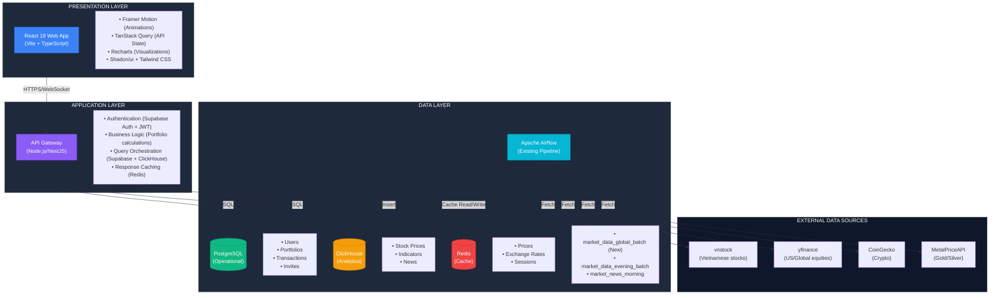

# Product Requirements Document (PRD)

## Finsight - Portfolio Intelligence Platform

| Attribute        | Value                        |
| ---------------- | ---------------------------- |
| **Version**      | 2.0                          |
| **Status**       | Draft - Architectural Review |
| **Last Updated** | December 23, 2025            |
| **Owner**        | LGTM-but-NY                  |
| **Stakeholders** | Engineering Team, Data Team  |

---

## 1. Document Purpose & Scope

This PRD defines the requirements for **Finsight**, a portfolio tracking web application that extends the existing Fin-Sight data pipeline with a user-facing frontend. This document serves as the single source of truth for product features, technical architecture, and implementation priorities.

**What This Document Covers:**

- Product vision and success metrics
- Feature requirements (MoSCoW prioritization)
- Technical architecture and integration patterns
- User experience guidelines
- Implementation roadmap

**What This Document Does NOT Cover:**

- Detailed API specifications (see separate API documentation)
- Database migration scripts (see TECHNICAL.md)
- UI component specifications (see Figma design system)

---

## 2. Product Vision

### 2.1 Problem Statement

**Current State:**

- Vietnamese investors use spreadsheets or generic portfolio apps lacking local market data
- Existing Fin-Sight pipeline delivers institutional-grade analytics (MACD, RSI) but only via Telegram notifications
- No unified view across global assets (VN stocks, US equities, crypto, commodities)

**User Pain Points:**

1. Manual data entry into spreadsheets is error-prone and time-consuming
2. Generic portfolio apps lack Vietnamese stock technical indicators
3. No "Zen" interface that reduces cognitive load during market volatility
4. Couples/investment clubs lack collaborative portfolio viewing

### 2.2 Solution Overview

**Finsight** transforms the existing Airflow + ClickHouse data warehouse into an interactive web application with:

1. **Spatial UI Design**: Horizontal stage-based navigation separating asset classes (Stocks/Crypto/Commodities)
2. **Real-Time Analytics**: Surface existing pipeline data (RSI, MACD, MA) through elegant visualizations
3. **Collaborative Portfolios**: Shared view permissions for teams/families
4. **AI-Enhanced Intelligence**: Leverage existing Gemini integration for personalized insights

**Differentiation:**

- Only portfolio tracker with Vietnamese stock technical indicators
- "Cinematic" minimalist UI vs cluttered financial dashboards
- Built on proven institutional data pipeline (Airflow + ClickHouse)

### 2.3 Success Metrics (6-Month Targets)

| Metric                      | Target              | Measurement Method   |
| --------------------------- | ------------------- | -------------------- |
| **Active Users**            | 500 DAU             | Google Analytics     |
| **Portfolio Value Tracked** | $10M USD equivalent | Database aggregation |
| **User Retention (30-day)** | 40%                 | Cohort analysis      |
| **Avg. Session Duration**   | 3 minutes           | Frontend telemetry   |
| **API Response Time (P95)** | < 200ms             | New Relic/Datadog    |

---

## 3. User Personas

### Primary Persona: "The Vietnamese Tech Investor"

**Demographics:**

- Age: 28-40
- Location: Ho Chi Minh City, Hanoi
- Occupation: Software engineer, startup founder
- Investment experience: 2-5 years

**Behaviors:**

- Tracks 10-15 Vietnamese stocks + 5-10 crypto assets
- Checks portfolio 2-3 times/day during market hours
- Uses technical indicators (RSI, MACD) for timing
- Prefers mobile access during commute

**Goals:**

- Reduce time spent on manual data entry
- Understand portfolio health at a glance
- Share portfolio performance with spouse
- Avoid panic selling during corrections

**Frustrations:**

- Spreadsheets break when adding new assets
- Generic apps show wrong prices for Vietnamese stocks
- Information overload causes decision paralysis

### Secondary Persona: "The Investment Club Member"

**Demographics:**

- Age: 35-50
- Group size: 4-8 members
- Collective AUM: $100K-500K

**Behaviors:**

- Monthly portfolio review meetings
- Collaborative research on new opportunities
- Rotates portfolio management duties

**Goals:**

- Transparent view of group holdings
- Track individual vs collective performance
- Easy onboarding for new members

---

## 4. Feature Requirements (MoSCoW Method)

### 4.1 Must Have (MVP - 3 months)

#### F1: User Authentication & Profile Management

**Description:** Secure user onboarding and session management

**Acceptance Criteria:**

- [ ] Users can sign up via Google OAuth (Supabase/Clerk integration)
- [ ] Email/password authentication available as fallback
- [ ] Profile includes: Display name, base currency preference (USD/VND/EUR)
- [ ] Session persists for 30 days with JWT refresh

**Technical Notes:**

- Use Supabase Auth for OAuth delegation
- Store user profiles in PostgreSQL `users` table
- JWT tokens include `user_id` and `base_currency`

---

#### F2: Portfolio Management - Transaction Entry

**Description:** Manual recording of buy/sell transactions

**Acceptance Criteria:**

- [ ] Users can add transaction with: Ticker, Type (Buy/Sell), Quantity, Price, Date, Notes
- [ ] Ticker autocomplete searches across VN/US/Crypto symbols from ClickHouse `dim_stock_companies`
- [ ] Validation: No future dates, quantity > 0, price > 0
- [ ] Transaction history displayed in chronological order
- [ ] Users can edit/delete transactions

**Data Flow:**

```
Frontend Form → API POST /transactions → Validate → PostgreSQL Insert → Return 201 Created
```

**Technical Notes:**

- Store in PostgreSQL `transactions` table (see schema in Section 6.2)
- Average transaction: Single INSERT < 50ms (PostgreSQL is ACID-compliant)

---

#### F3: Spatial UI Dashboard - The Stage Slider

**Description:** Horizontal swipeable stages for asset class separation

**Acceptance Criteria:**

- [ ] Three stages render: **Global Equities**, **Crypto**, **Commodities**
- [ ] Swipe gesture (mobile) or arrow keys (desktop) navigate stages
- [ ] Each stage shows:
  - Total value in base currency
  - 24h change (% and absolute)
  - Sparkline of last 30 days
  - Top 3 holdings (by value)
- [ ] Active stage has distinct background glow (CSS gradient)
- [ ] Stage transition animation < 300ms (60fps via Framer Motion)

**Visual Mockup Reference:**

```
┌─────────────────────────────────────────┐
│  ◄  [Global Equities]  [Crypto]  [Gold] ►│
│                                         │
│      $45,320 USD   ▲ 2.3%             │
│      ╱╲   ╱╲                           │
│   ▁▂╱  ╲╱  ╲▃▄ (30-day sparkline)     │
│                                         │
│   Top Holdings:                        │
│   • VCB  $12,000  (26%)                │
│   • AAPL $8,500   (19%)                │
│   • HPG  $7,200   (16%)                │
└─────────────────────────────────────────┘
```

**Technical Notes:**

- Use Framer Motion `<motion.div>` with `drag="x"` constraint
- Fetch aggregated data from API `GET /portfolio/stage-summary?stage=equities`
- Sparkline renders via Recharts `<LineChart>` (simplified, no axes)

---

#### F4: Real-Time Market Data Display

**Description:** Surface ClickHouse analytics in user holdings

**Acceptance Criteria:**

- [ ] Each asset card shows:
  - Current price (updated every 60s via polling)
  - Daily change (%)
  - Technical indicators: RSI-14, MACD, MA-50/200 position
  - Last updated timestamp
- [ ] Price color coding: Green (gain), Red (loss), Gray (no change)
- [ ] Technical indicator badges:
  - RSI > 70: "Overbought" (Orange badge)
  - RSI < 30: "Oversold" (Blue badge)
  - Price > MA200: "Bullish Trend" (Green checkmark)

**Data Source:**

- API queries ClickHouse `view_market_daily_master` for latest row per ticker
- Returns JSON: `{ticker, price, change_pct, rsi_14, macd, ma_50, ma_200, updated_at}`

---

#### F5: Net Worth Calculation Engine

**Description:** Aggregate holdings across all stages

**Acceptance Criteria:**

- [ ] Calculate total portfolio value: Σ(quantity × latest_price) for all transactions
- [ ] Convert to user's base currency using exchange rates
- [ ] Display on dashboard header:
  - Total Net Worth
  - All-time return ($, %)
  - 1D/1W/1M/1Y performance
- [ ] Calculation updates every 60s when dashboard is active

**Business Logic:**

```typescript
// Shared type from @repo/types
import { NetWorthCalculation, Database } from '@repo/types';
import { SupabaseService } from '@repo/database';

async calculateNetWorth(userId: string, baseCurrency: string): Promise<NetWorthCalculation> {
  // 1. Get all user transactions (Supabase with auto-generated types)
  const { data: transactions } = await this.supabase
    .from('transactions')
    .select('*')
    .eq('user_id', userId)
    .order('transaction_date', { ascending: true });

  // 2. Group by ticker, calculate holdings
  const holdings = this.aggregateHoldings(transactions);

  // 3. Fetch current prices (ClickHouse via @repo/database)
  const tickers = Object.keys(holdings);
  const prices = await this.marketService.getLatestPrices(tickers);

  // 4. Calculate value with currency conversion
  const totalValue = Object.entries(holdings).reduce((sum, [ticker, holding]) => {
    const price = prices[ticker];
    const rate = this.exchangeRate(price.currency, baseCurrency);
    return sum + holding.quantity * price.value * rate;
  }, 0);

  // 5. Calculate returns
  const totalCostBasis = transactions
    .filter(t => t.transactionType === 'BUY')
    .reduce((sum, t) => sum + t.quantity * t.pricePerUnit, 0);

  return {
    netWorth: totalValue,
    totalReturn: totalValue - totalCostBasis,
    totalReturnPct: ((totalValue - totalCostBasis) / totalCostBasis) * 100
  };
}
```

---

### 4.2 Should Have (V1.0 - 6 months)

#### F6: Focus Mode - Detailed Asset View

**Description:** Click-to-expand modal with comprehensive charts

**Acceptance Criteria:**

- [ ] Click on asset card opens full-screen modal with glassmorphism backdrop
- [ ] Display:
  - Interactive candlestick chart (1Y daily OHLC from ClickHouse)
  - Overlays: MA50, MA200, Buy/Sell markers from user transactions
  - Technical panel: RSI, MACD histogram, Volume bars
  - Fundamental panel: P/E, ROE, Revenue Growth (from `fact_financial_ratios`)
  - News feed: Last 10 articles mentioning ticker (from `fact_news`)
- [ ] Chart supports zoom (pinch/scroll) and pan (drag)
- [ ] ESC key or backdrop click closes modal

**Technical Notes:**

- Use Recharts `<ComposedChart>` with custom tooltip
- Fetch historical data: `GET /market/ohlc?ticker={ticker}&start={1_year_ago}`
- Transaction markers: Render `<Dot>` at (date, price) coordinates

---

#### F7: Team Portfolios - Collaborative View

**Description:** Share portfolio access with multiple users

**Acceptance Criteria:**

- [ ] Portfolio owner can invite users via email
- [ ] Roles: **Owner** (full control), **Editor** (add transactions), **Viewer** (read-only)
- [ ] Invitees receive email with magic link (Supabase Auth)
- [ ] Shared portfolio shows all members' names in header
- [ ] Activity log: "Alice bought 10 AAPL on Dec 20" (visible to all members)

**Database Schema:**

```sql
CREATE TABLE portfolio_members (
  portfolio_id UUID REFERENCES portfolios(id),
  user_id UUID REFERENCES users(id),
  role VARCHAR(10) CHECK (role IN ('owner', 'editor', 'viewer')),
  invited_at TIMESTAMP,
  PRIMARY KEY (portfolio_id, user_id)
);
```

---

#### F8: Asset Allocation Visualizations

**Description:** Radar chart and treemap for diversification analysis

**Acceptance Criteria:**

- [ ] **Allocation Radar**: Pentagon chart showing % allocation by:
  - Asset class (Stocks/Crypto/Commodities/Cash)
  - Geography (Vietnam/US/Global)
  - Sector (Tech/Finance/Energy/Consumer)
- [ ] **Treemap**: Nested rectangles sized by holding value
  - Outer level: Asset class
  - Inner level: Individual tickers
  - Color: Performance (Green = gain, Red = loss)
- [ ] Both charts update on stage navigation

**Technical Notes:**

- Use Recharts `<RadarChart>` and D3.js treemap library
- Calculate allocations: `SELECT asset_class, SUM(value) FROM holdings GROUP BY asset_class`

---

#### F9: Multi-Currency Support

**Description:** Toggle dashboard base currency

**Acceptance Criteria:**

- [ ] Currency selector in header: USD, VND, EUR, SGD
- [ ] All monetary values convert in real-time using exchange rates
- [ ] Exchange rates refresh every 5 minutes (via `exchangerate-api.com`)
- [ ] User preference persists in profile

**Technical Notes:**

- Store exchange rates in Redis with 5-min TTL
- Fallback to ClickHouse `fact_exchange_rates` table if API fails

---

### 4.3 Nice to Have (V1.5 - 12 months)

#### F10: AI Portfolio Insights (Gemini Integration)

**Description:** Natural language summaries of portfolio changes

**Acceptance Criteria:**

- [ ] Weekly email digest: "Your portfolio gained 3.2% this week, driven by HPG's 12% rally after Q3 earnings beat"
- [ ] Actionable alerts: "Your crypto allocation reached 40%, exceeding your 30% target"
- [ ] Reuses existing Airflow DAG: `summarize_news_with_gemini`
- [ ] User can configure alert thresholds in settings

**Prompt Engineering Example:**

```
Given the following portfolio data:
- Holdings: {holdings_json}
- Recent transactions: {transactions_json}
- Latest news: {news_json}
- Technical indicators: {indicators_json}

Generate a 3-sentence summary explaining:
1. Primary driver of weekly performance
2. Any asset class rebalancing suggestions
3. One risk to monitor
```

---

#### F11: Simulation Mode - Backtesting

**Description:** "What if?" scenarios for past investment decisions

**Acceptance Criteria:**

- [ ] User selects date range (e.g., "Jan 1, 2023 to Dec 31, 2024")
- [ ] UI replays portfolio value changes day-by-day
- [ ] Timeline scrubber allows jumping to specific dates
- [ ] Compare simulated vs actual performance if historical transactions exist

**Technical Notes:**

- Query ClickHouse `fact_stock_daily` for historical prices
- Calculate portfolio value: `Σ(holdings_on_date × price_on_date)`
- Animate value changes using Framer Motion `useSpring`

---

#### F12: Commodity Unit Conversion

**Description:** Toggle between mass units for precious metals

**Acceptance Criteria:**

- [ ] Gold/Silver cards show unit selector: Troy Ounce / Gram / Tael / Kilogram
- [ ] Price and quantity auto-convert
- [ ] Example: "1 oz Gold @ $2,050" ↔ "31.1g Gold @ $65.88/g"

---

### 4.4 Out of Scope (Not Planned)

| Feature                       | Reason for Exclusion                                           |
| ----------------------------- | -------------------------------------------------------------- |
| **Real Estate Tracking**      | Property valuations require manual appraisals, no reliable API |
| **Social/Community Features** | Increases moderation burden, conflicts with "Zen" philosophy   |
| **Trading Execution**         | Requires brokerage integration, regulatory compliance          |
| **Tax Reporting**             | Complex regional tax laws, defer to specialized tools          |
| **Direct ClickHouse Access**  | Security risk, concurrency issues (see Section 5.2)            |

---

## 5. Technical Architecture

### 5.1 System Architecture Overview

**Architectural Pattern:** Three-Tier Architecture with Event-Driven Data Layer



---

### 5.2 Why NOT Connect Frontend Directly to ClickHouse?

**Critical Architectural Decision:**

❌ **DO NOT** expose ClickHouse (port 8123) to the public web  
✅ **DO** introduce an API Gateway layer

**Rationale:**

| Risk            | Impact                                                                                | Mitigation                                                 |
| --------------- | ------------------------------------------------------------------------------------- | ---------------------------------------------------------- |
| **Security**    | Exposing raw DWH to client-side code allows SQL injection, credential theft           | API layer validates queries, enforces row-level security   |
| **Concurrency** | ClickHouse optimized for analytical queries (100ms-1s), not 1000s of concurrent users | API caches hot data in Redis, aggregates requests          |
| **Latency**     | Complex JOINs (e.g., `view_valuation_daily`) can take 200-500ms                       | Materialized views + Redis caching achieve <50ms responses |
| **Cost**        | Direct queries waste compute on repeated requests                                     | Query result caching reduces ClickHouse load by 80%        |

**The Solution: Hybrid Storage Pattern**

```
User Request → API Gateway → Decision Tree:
│
├─ [Hot Data] (Prices updated <5 min ago)
│   → Redis Cache → Return (10ms latency)
│
├─ [User Data] (Portfolios, Transactions)
│   → PostgreSQL → Return (20ms latency)
│
└─ [Analytical Data] (Historical OHLC, Technical Indicators)
    → ClickHouse → Cache in Redis → Return (150ms first request, 10ms subsequent)
```

---

### 5.3 Technology Stack

#### 5.3.1 Frontend

| Component             | Technology      | Version | Rationale                                                      |
| --------------------- | --------------- | ------- | -------------------------------------------------------------- |
| **Framework**         | React           | 19.0    | Latest features: Actions, useOptimistic for instant UI updates |
| **Build Tool**        | Vite            | 6.x     | 10x faster HMR than Webpack, native ESM                        |
| **Language**          | TypeScript      | 5.x     | Type safety, better IDE support                                |
| **Styling**           | Tailwind CSS    | 4.x     | Utility-first, JIT compilation                                 |
| **Component Library** | Shadcn/ui       | Latest  | Radix UI primitives, fully customizable                        |
| **Animation**         | Framer Motion   | 11.x    | 60fps animations, gesture support                              |
| **Charts**            | Recharts        | 2.x     | React-native API, composable                                   |
| **State Management**  | TanStack Query  | 5.x     | Server state caching, optimistic updates                       |
| **Forms**             | React Hook Form | 7.x     | Uncontrolled inputs, Zod validation                            |

**Why React 19?**

- **useOptimistic Hook**: Instant UI feedback while awaiting API responses (critical for transaction entry)
- **Server Actions**: Simplified data mutations without explicit fetch calls
- **Improved Suspense**: Better loading states for async components

---

#### 5.3.2 API Layer (Node.js/NestJS)

| Component             | Technology              | Rationale                                                      |
| --------------------- | ----------------------- | -------------------------------------------------------------- |
| **Framework**         | NestJS                  | Enterprise-grade, dependency injection, modular architecture   |
| **Language**          | TypeScript 5.x          | End-to-end type safety with frontend, better DX                |
| **Validation**        | class-validator + Zod   | Runtime validation, shared schemas with frontend               |
| **Database Client**   | Supabase JS             | Type-safe client, auto-generated types, RLS, real-time support |
| **ClickHouse Client** | @clickhouse/client      | Official Node.js driver, connection pooling                    |
| **Caching**           | ioredis                 | High-performance Redis client, cluster support                 |
| **Authentication**    | Supabase Auth + NestJS  | JWT validation, OAuth providers, magic links, RLS integration  |
| **API Docs**          | @nestjs/swagger         | Auto-generated OpenAPI specs from decorators                   |

**Why NestJS over Express/Fastify:**

- **Dependency Injection**: Testable, maintainable code through IoC container
- **Modular Architecture**: Clear separation of concerns (modules, controllers, services)
- **Built-in Features**: Guards, interceptors, pipes for cross-cutting concerns
- **TypeScript-First**: Decorators and metadata for cleaner code
- **Scalability**: Microservices support for future growth

---

#### 5.3.3 Data Pipeline Enhancements (Airflow)

**New DAG: `market_data_global_batch`**

```python
# Schedule: 6:00 PM UTC+7 (after US market close)
# Description: Fetch US stocks, crypto, commodities

from airflow import DAG
from airflow.decorators import task_group

@task_group
def us_equities_pipeline():
    @task
    def fetch_us_stocks():
        import yfinance as yf
        tickers = ['AAPL', 'MSFT', 'GOOGL', 'AMZN', 'NVDA']
        data = yf.download(tickers, period='1d')
        # Transform, calculate indicators
        return data

    @task
    def load_us_stocks(data):
        # Insert to ClickHouse fact_stock_daily
        # with market_type='US'
        pass

@task_group
def crypto_pipeline():
    @task
    def fetch_crypto_prices():
        import requests
        url = 'https://api.coingecko.com/api/v3/coins/markets'
        params = {'vs_currency': 'usd', 'ids': 'bitcoin,ethereum'}
        # Transform to OHLCV format
        pass

@task_group
def commodity_pipeline():
    @task
    def fetch_gold_silver():
        # MetalPriceAPI integration
        pass
```

**Schema Migration:**

```sql
-- Extend existing ClickHouse table
ALTER TABLE market_dwh.fact_stock_daily
ADD COLUMN market_type Enum8('VN'=1, 'US'=2, 'CRYPTO'=3, 'COMMODITY'=4) DEFAULT 'VN';

-- Add index for new queries
ALTER TABLE market_dwh.fact_stock_daily
ADD INDEX idx_market_type market_type TYPE set(0) GRANULARITY 4;
```

---

### 5.4 Database Schema Design

#### 5.4.1 PostgreSQL (Operational Database)

**Purpose:** Store user-generated data requiring ACID guarantees

```sql
-- Users table (managed by Supabase Auth)
CREATE TABLE users (
  id UUID PRIMARY KEY DEFAULT gen_random_uuid(),
  email VARCHAR(255) UNIQUE NOT NULL,
  display_name VARCHAR(100),
  base_currency VARCHAR(3) DEFAULT 'USD',
  created_at TIMESTAMP DEFAULT NOW(),
  last_login TIMESTAMP
);

-- Portfolios table
CREATE TABLE portfolios (
  id UUID PRIMARY KEY DEFAULT gen_random_uuid(),
  owner_id UUID REFERENCES users(id) ON DELETE CASCADE,
  name VARCHAR(100) NOT NULL,
  description TEXT,
  is_shared BOOLEAN DEFAULT FALSE,
  created_at TIMESTAMP DEFAULT NOW()
);

-- Transactions table
CREATE TABLE transactions (
  id UUID PRIMARY KEY DEFAULT gen_random_uuid(),
  portfolio_id UUID REFERENCES portfolios(id) ON DELETE CASCADE,
  user_id UUID REFERENCES users(id),
  ticker VARCHAR(20) NOT NULL,
  market_type VARCHAR(10) NOT NULL, -- 'VN', 'US', 'CRYPTO', 'COMMODITY'
  transaction_type VARCHAR(4) CHECK (transaction_type IN ('BUY', 'SELL')),
  quantity DECIMAL(20, 8) NOT NULL CHECK (quantity > 0),
  price_per_unit DECIMAL(20, 8) NOT NULL CHECK (price_per_unit > 0),
  transaction_date DATE NOT NULL CHECK (transaction_date <= CURRENT_DATE),
  notes TEXT,
  created_at TIMESTAMP DEFAULT NOW(),
  updated_at TIMESTAMP DEFAULT NOW()
);

-- Portfolio members (for shared portfolios)
CREATE TABLE portfolio_members (
  portfolio_id UUID REFERENCES portfolios(id) ON DELETE CASCADE,
  user_id UUID REFERENCES users(id) ON DELETE CASCADE,
  role VARCHAR(10) CHECK (role IN ('owner', 'editor', 'viewer')),
  invited_at TIMESTAMP DEFAULT NOW(),
  PRIMARY KEY (portfolio_id, user_id)
);

-- Indexes for query optimization
CREATE INDEX idx_transactions_portfolio ON transactions(portfolio_id, transaction_date DESC);
CREATE INDEX idx_transactions_ticker ON transactions(ticker, transaction_date);
CREATE INDEX idx_portfolio_members_user ON portfolio_members(user_id);
```

**Design Notes:**

- `quantity` uses `DECIMAL(20,8)` to support crypto fractional units (0.00000001 BTC)
- `transaction_date` separate from `created_at` (allows backdated entries)
- Foreign keys use `ON DELETE CASCADE` (deleting user removes all data)

---

#### 5.4.2 ClickHouse (Analytical Database)

**Modifications to Existing Schema:**

```sql
-- 1. Extend fact_stock_daily for global markets
ALTER TABLE market_dwh.fact_stock_daily
ADD COLUMN market_type Enum8('VN'=1, 'US'=2, 'CRYPTO'=3, 'COMMODITY'=4) DEFAULT 'VN',
ADD COLUMN base_currency String DEFAULT 'VND'; -- USD for US stocks, USDT for crypto

-- 2. Create exchange rates table
CREATE TABLE market_dwh.fact_exchange_rates (
  from_currency String,
  to_currency String,
  rate Float64,
  rate_date Date,
  source String,  -- 'exchangerate-api', 'manual'
  ingested_at DateTime DEFAULT now()
) ENGINE = ReplacingMergeTree(ingested_at)
ORDER BY (from_currency, to_currency, rate_date);

-- 3. Create user holdings snapshot table (for performance)
CREATE TABLE market_dwh.fact_user_holdings (
  user_id UUID,
  ticker String,
  market_type String,
  quantity Decimal64(8),
  avg_cost_basis Decimal64(2),
  snapshot_date Date,
  ingested_at DateTime DEFAULT now()
) ENGINE = ReplacingMergeTree(ingested_at)
PARTITION BY toYYYYMM(snapshot_date)
ORDER BY (user_id, ticker, snapshot_date);

-- 4. Create materialized view for latest prices
CREATE MATERIALIZED VIEW market_dwh.mv_latest_prices
ENGINE = AggregatingMergeTree()
ORDER BY ticker
AS SELECT
  ticker,
  market_type,
  argMax(close, trading_date) as latest_price,
  argMax(trading_date, trading_date) as last_updated,
  argMax(rsi_14, trading_date) as latest_rsi,
  argMax(macd, trading_date) as latest_macd
FROM market_dwh.fact_stock_daily
GROUP BY ticker, market_type;
```

**Why These Changes?**

| Change                | Purpose                       | Performance Benefit                        |
| --------------------- | ----------------------------- | ------------------------------------------ |
| `market_type` enum    | Separate VN/US/Crypto queries | Index scan vs full table scan (10x faster) |
| `fact_exchange_rates` | Real-time currency conversion | Avoid repeated API calls                   |
| `fact_user_holdings`  | Pre-aggregated holdings       | 100x faster than joining transactions      |
| `mv_latest_prices`    | Materialized latest data      | Sub-10ms queries for dashboard             |

---

### 5.5 API Design Patterns

#### 5.5.1 RESTful Endpoints

**Base URL:** `https://api.finsight.app/v1`

| Endpoint                        | Method | Purpose                      | Caching Strategy         |
| ------------------------------- | ------ | ---------------------------- | ------------------------ |
| `/auth/login`                   | POST   | OAuth callback               | No cache                 |
| `/users/me`                     | GET    | User profile                 | Redis 5min               |
| `/portfolios`                   | GET    | List user portfolios         | No cache (stale allowed) |
| `/portfolios/{id}/summary`      | GET    | Aggregated holdings          | Redis 1min               |
| `/portfolios/{id}/transactions` | GET    | Transaction history          | No cache                 |
| `/portfolios/{id}/transactions` | POST   | Add transaction              | Invalidate cache         |
| `/market/latest`                | GET    | Latest prices (multi-ticker) | Redis 30sec              |
| `/market/ohlc/{ticker}`         | GET    | Historical OHLC              | Redis 1                  |
