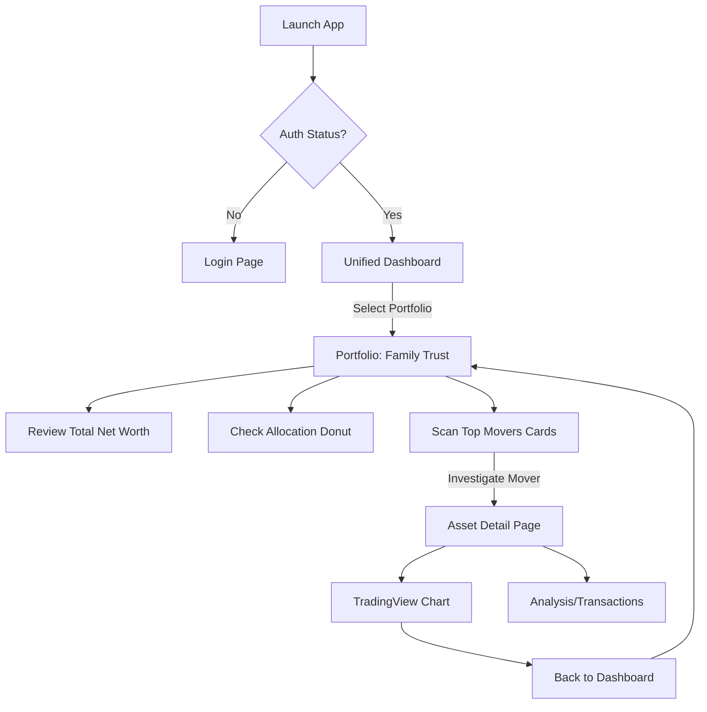
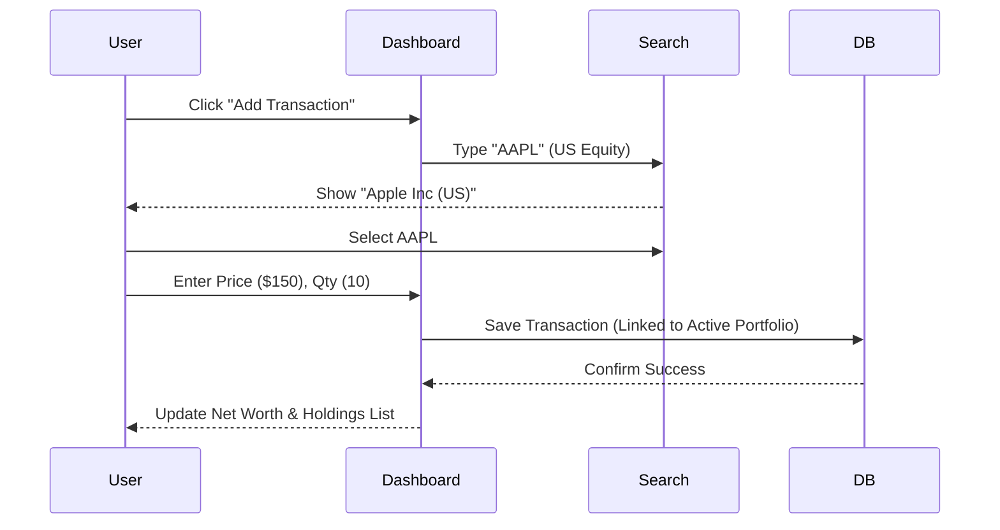
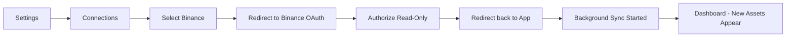

# UX Design Specification: portfolios-tracker

**Author:** Son  
**Date:** 2025-12-26  
**Version:** 1.0 (Complete)

---

## Executive Summary

### Product Vision

Portfolios Tracker transforms cross-border portfolio tracking from fragmented anxiety into **consolidated calm**. Built for investors managing Vietnamese stocks, US equities, and cryptocurrency across multiple accounts, portfolios-tracker delivers institutional-grade analytics through an Enhanced Tabbed Navigation interface with premium micro-interactions that encourages exploration during market volatility instead of panic-driven exits.

The product bridges a critical gap: no existing platform offers unified VN + US + crypto tracking with transparent methodology and multi-currency fluency (VND/USD/USDT). By treating each asset class as a first-class citizen and exposing calculation lineage, portfolios-tracker positions as the "adult in the room" for tech-savvy investors who distrust black-box analytics.

**Core Differentiator:** The only tracker that makes cross-border Vietnamese wealth feel simple — pairing institutional data quality with a calming, polished interface designed to reduce volatility-driven overwhelm.

---

### Target Users

**Primary: Cross-Border Tech Professionals (Age 25-40)**

- Vietnamese working abroad or internationally-exposed locals
- Portfolio: VN stocks (30-40%) + US equities (30-40%) + Crypto (20-30%)
- Current behavior: Juggling 5+ apps (SSI iBoard, Schwab, Binance, TradingView, Excel)
- Pain: Manual reconciliation, no FX gain separation, fragmented mental model
- Success metric: "Finally, one place to see my whole picture without switching contexts"

**Secondary: Vietnamese Retail Investors (Age 25-45, Urban)**

- Middle-class Vietnamese managing 50M-500M VND portfolios across SSI/VPS/VCBS
- Behavior: 70% mobile trading, concentrated in VN30 blue chips
- Pain: No multi-brokerage aggregation, weak portfolio analytics beyond basic P&L
- Success metric: "I can track all my Vietnamese stocks in one view and compare with my crypto holdings"

**Tertiary: Small Investment Teams & Family Offices**

- Overseas Vietnamese managing family wealth, local investment clubs
- Need: Shared portfolios, audit trails, collaborative decision-making
- Pain: Single-user tools force workarounds, no roles/permissions
- Success metric: "Our family can track Grandma's VN stocks and Dad's US portfolio together"

---

### Key Design Challenges

**1. Navigation Pattern: Safety vs Innovation**

- **Challenge:** Balance proven usability (tabs) with differentiation (premium feel)
- **Solution:** Enhanced Tabbed Navigation with smooth micro-interactions (200ms transitions, animated indicators, keyboard shortcuts)
- **Research basis:** Nielsen Norman Group data shows horizontal scrolling causes negative user reactions; tabs "just work"

**2. Calm-Under-Volatility Experience Design**

- **Goal:** 2+ minute sessions during VN down-days (≤-1.5% VN-Index) with 1.4× tab-switching
- **Balance:** Information density + emotional design to reduce panic, encourage exploration
- **Color psychology:** Red/green gains/losses without triggering stress; staleness badges without anxiety

**3. Multi-Asset Cognitive Switching**

- **Context:** Users toggle between VN stocks (VND, T+2, 9-3pm ICT) ↔ US (USD, instant, 9:30-4pm EST) ↔ Crypto (USDT, 24/7)
- **Challenge:** Each asset class has distinct mental models (settlement, hours, volatility)
- **Solution:** Clear tab labels with badges (count + value), unobtrusive currency conversions, timezone cues

**4. Rapid Drill-Down Navigation (≤3 Clicks)**

- **Requirement:** Net Worth → Portfolio → Asset → Transaction in ≤3 clicks
- **Mobile constraint:** Touch targets ≥44px, limited screen real estate
- **Architecture:** Tab-based switching + information hierarchy that supports speed without losing breadcrumb context

**5. Crypto API Integration (95% Success Rate)**

- **Scope change:** Replaced CSV import with Crypto API integration (Binance + OKX)
- **Challenge:** OAuth flow, real-time sync, connection management, error recovery
- **Target:** ≥98% successful connection rate; 5-second sync; clear disconnect/reconnect flows

---

### Design Opportunities

**1. Enhanced Tabs as Premium Differentiator**

- Opportunity to elevate standard tabs with portfolios-tracker's "design moment"
- Smooth transitions (fade + 30px slide), animated underline, keyboard shortcuts (Cmd+1/2/3/4)
- Mobile: Swipe gestures feel native; Desktop: Arrow key navigation
- **Differentiation through polish, not novelty**

**2. Transparent Methodology as Trust Builder**

- Inline methodology via **info icon hover cards** differentiate from black-box competitors
- Space-efficient progressive disclosure: Hover icon → see formula & data source in hover card
- Builds educational trust: "This is how we calculate your cost basis (FIFO), here's the FX rate source"
- **UX Rationale:** HoverCards preserve screen real estate while maintaining transparency; no content shift on expansion; better UX than tooltips with richer content display and hover activation (no click required)

**3. Cross-Border Narrative & Multi-Currency Storytelling**

- FX gain separation tells richer story: "Assets +8%, but VND weakened -2% vs USD"
- Visual language: Flags, currency symbols, timezone badges as wayfinding
- Positions as "built for overseas Vietnamese managing wealth across borders"

**4. Freemium Conversion at Natural Friction**

- Upgrade prompts at "20 asset limit" feel earned, not intrusive
- Modal messaging around outcomes: "Track your full wealth without limits; see precise insights"
- Opportunity: Optimize VND/USD payment UX via SePay.

**5. Mobile-First for Vietnamese Market (70% Mobile Trading)**

- Bottom tab bar on mobile (≤640px) optimized for thumb reach
- Horizontal scrollable tabs on tablet (641-1024px)
- Push notification opportunity: "VN-Index down 2%, your US holdings offset -0.5%"

---

## Strategic Decisions

### Navigation Pattern: Unified Portfolio Dashboard (v1.0)

**Decision Date:** 2025-12-27
**Decision:** Adopt **Unified Portfolio Dashboard** as the primary interaction model.

**Rationale:**

- **Professional Context:** Asset managers and serious investors view wealth holistically, regardless of asset class (VN vs US vs Crypto). Segregation creates friction.
- **Scalability:** The system must support **Multiple Portfolios** (e.g., "Personal Fund", "Family Trust", "Trading Bot"). A unified view per portfolio is scalable; rigid asset-class tabs are not.
- **Risk Management:** Aggregated allocation views (Donut Chart) allow immediate risk assessment across all holdings.

**Key Features:**

1. **Multi-Portfolio Architecture:** Users can switch between different portfolios. Each portfolio has its own unified dashboard.
2. **Unified Holdings Table:** Mixing VN Stocks, US Equities, and Crypto in one sortable, filterable list.
3. **Performance-First:** Large time-series chart showing aggregated Net Worth history.

---

## User Journeys (Flows)

### 1. Daily Check-In & Portfolio Review

**Goal:** Assess total wealth health of a specific portfolio (e.g., "Family Trust") in < 2 minutes.

### 2. Manual Asset Entry (Cross-Border)

**Goal:** Add a US Stock purchase to the current portfolio.

### 3. Syncing Crypto Exchange

**Goal:** Zero-maintenance tracking for crypto assets.

## Screen Specifications (Dev Ready)

### 1. Dashboard (`/dashboard`) - Portfolio List View

The entry point after login. Displays **all user portfolios as cards**, not holdings directly.

- **Layout:** `DashboardLayout` (Sidebar + Top Bar)
- **Primary Components:**
  - `PortfolioCardList`: Grid of portfolio summary cards
    - Each card shows: Portfolio name, Net Worth, P/L (absolute + %), allocation mini-donut
    - Click card → navigates to `/portfolio/:id`
  - `CreatePortfolioCard`: CTA card to create new portfolio
  - `TotalNetWorthSummary`: Aggregated net worth across ALL portfolios (optional header)
- **Empty State:** If no portfolios, show Empty component with "Create Your First Portfolio" CTA

### 2. Portfolio Detail (`/portfolio/:id`)

Drill-down view for a **single portfolio**. This is where the UnifiedHoldingsTable lives.

- **Layout:** `DashboardLayout` with portfolio context in header
- **Primary Components:**
  - `PortfolioHeader`: Portfolio name, Net Worth, P/L, base currency
  - `PortfolioHistoryChart`: Time-series Net Worth data (1D/1W/1M/YTD/ALL)
  - `AllocationDonut`: Asset class breakdown (VN / US / Crypto)
  - `SummaryStats`: Net Worth, 24h P/L, Cash Balance
  - `UnifiedHoldingsTable`: List of holdings for **THIS portfolio only**
    - Cols: Name, Ticker, Type (Badge), Price, 24h %, Value (Base Currency), P/L (with info icon)
    - Filter bar: [All] [VN] [US] [Crypto]
    - Info icon tooltip → Shows calculation method & data source (Story 2.5)
- **API:** `GET /portfolios/:id/holdings`

### 3. Asset Detail (`/portfolio/:id/asset/:symbol`)

Deep dive into a specific holding.

- **Components:**
  - `TradingViewWidget`: Advanced charting.
  - `TransactionHistory`: List of buy/sells for this asset _within this portfolio_.
  - `PerformanceCard`: Realized vs Unrealized P/L.
- **Context:** Accessible via clicking a row in the Dashboard table.

### 4. Connections (`/settings/connections`)

API Management.

- **Components:**
  - `IntegrationCard`: Logo, Status (Connected/Disconnected), "Sync Now" button.
  - `APIKeyForm`: For exchanges not supporting OAuth.

## Deliverables Checklist

- [ ] Refactor `DashboardLayout` to implement Unified View and Portfolio Selector.
- [ ] Implement `UnifiedHoldingsTable` with multi-currency normalization.
- [ ] Create `PortfolioHistory` chart component.
- [ ] Build `AssetDetail` page.

## UI Design Reference

**Visual Concept:**

---

## UX Principles

- Clarity-first: Prioritize legibility, hierarchy, and minimalism during volatility.
- Predictability: Favor familiar patterns; reduce surprises with progressive disclosure.
- Calm motion: Short, subtle transitions; respect `prefers-reduced-motion`.
- Trust through transparency: Show methodology, data freshness, and calculation lineage.
- Speed to value: ≤ 3 clicks to drill; ≤ 15 minutes to first complete portfolio.

## Information Architecture

- **Global structure:** Dashboard (portfolio list) → Portfolio Detail (holdings with asset-class filters) → Asset → Transaction.
- **Navigation flow:** Dashboard shows portfolio cards; clicking a card drills into portfolio detail with UnifiedHoldingsTable; clicking a holding navigates to Asset Detail; hovering info icons shows methodology hover cards.
- **Content hierarchy:** Portfolio cards first, then holdings list with filtering; charts and detailed analytics in Portfolio Detail and Asset Detail views.

## Core Screens

### Dashboard (Home) - `/dashboard`

- **Portfolio List View:** Grid of portfolio cards showing name, net worth, P/L, allocation mini-donut.
- Click card → navigate to Portfolio Detail (`/portfolio/:id`).
- Summary header: Total net worth across all portfolios (optional).
- Quick actions: Create portfolio, connect exchange.

### Portfolio Detail - `/portfolio/:id`

- **Holdings table** (`UnifiedHoldingsTable`) with asset-class filter bar: [All] [VN] [US] [Crypto].
- Info icon hover card → Shows calculation method & data source (Story 2.5).
- Allocation donut, net worth chart, performance sparklines.
- Staleness indicators; polling status; export actions.

### Asset Detail

- TradingView chart embed (RSI/MACD/MA); interval controls; reduced motion fallback.
- Lots and transactions list; realized/unrealized PnL; FX gain separation where applicable.
- Info icon hover cards → Show calculation method & data source (Story 2.5, 2.6).
- Data source disclosure and last refresh timestamps.

### Transactions

- Manual entry form with autocomplete (symbols, recent assets); keyboard shortcuts; fee support.
- Batch add mode (Phase 2); validation with actionable hints.

### Settings → Connections

- Connect Binance/OKX via OAuth; status, last sync, error states with clear recovery.
- Read-only permission messaging; disconnect/reconnect flows; rate-limit handling.

## Component Strategy

- Tabs: Animated underline; arrow-key navigation; badges for count/value; swipe on mobile.
- Cards: Net worth, allocations, freshness; consistent elevation; skeleton loading states.
- Tables/Lists: Virtualized for performance; sticky headers; responsive columns.
- Charts: TradingView components lazy-loaded; accessibility labels; reduced motion.
- Forms: Autocomplete, keyboard shortcuts (`Cmd+1/2/3/4` for tabs; `Enter` to submit); inline validation.
- Status: Staleness badge (color-neutral), sync badge, error toasts with specific cause.

## Motion & Micro-Interactions

- Defaults: 200ms fade + 30px slide for tab transitions; easing: standard cubic-bezier.
- Reduced motion: Disable slide; retain minimal fade; skip chart animations.
- Feedback: Subtle success checkmarks; non-blocking toasts; focus management on form submit.

## Accessibility

- WCAG 2.1 AA; color contrast ≥ 4.5:1; keyboard navigable tabs and forms.
- ARIA roles/labels for tabs, charts, tables; screen-reader friendly status messages for staleness/sync.
- Respect `prefers-reduced-motion` and `prefers-color-scheme`.

## Responsive Behavior

- Breakpoints: sm ≤ 640px (bottom tab bar), md 641–1024px (scrollable tabs), lg 1025–1440px (standard tabs), xl ≥ 1441px (optional split-view compare in Phase 2).
- Touch targets ≥ 44px; sticky headers; thumb-friendly controls.
- Avoid horizontal overflow; content stacks gracefully on smaller viewports.

## Design System

- Colors: Calm neutrals; measured reds/greens; status colors for staleness (neutral amber).
- Typography: Clean sans-serif; clear typographic scale; numeric tabular lining for financial figures.
- Grid/Spacing: 8px base; consistent rhythm; predictable density.
- Elevation: Minimal; reserved for interactive surfaces.

## Instrumentation & Metrics

- Client events: Tab changes, dwell time, refresh clicks, form submits.
- Freshness tracking: Time since last price update; banner display rate.
- Conversion: Limit-hit prompts, payment success, recon retries.
- Accessibility audits: Automated checks in CI; quarterly manual reviews.

## Edge Cases & Recovery States

- Price staleness > 5 minutes: Banner + retry; exponential backoff; manual refresh.
- API failures: Clear cause labels (expired key, rate limit); reconnect CTA.
- Payment failures: Persisted state; retriable workflow; no partial upgrades.
- Import deferred: CSV import flagged as experimental (Phase 2) if needed.

## Acceptance Criteria (UX)

- Drill-down ≤ 3 clicks; export ≤ 2 seconds.
- Crypto connect success ≥ 98%; balances within 5 seconds; polling cadence ≈ 60s.
- Calm proxy on down days: session ≥ 2 minutes; tab switches ≥ 1.4× baseline.
- Accessibility: Keyboard navigation, screen-reader labels, reduced motion respected.

## Deliverables

- Wireframes for corescreens (dashboard, portfolio, asset, transactions, connections).
- Component specs (tabs, tables, cards, badges, charts, forms).
- Motion tokens and accessibility checklist.
- Instrumentation plan mapped to success metrics.

## UI Design & Visualization (V2: Unified)

### Dashboard Content Mockup (V2)

Based on user feedback, the design has shifted from an "Asset Class Silo" approach to a **Unified Portfolio View**. This better supports asset managers holding mixed assets (VN/US/Crypto) in single portfolios.

**Design Artifact:** [Dashboard V2 Mockup](dashboard-ui-mockup-v2.md)

**Visual Concept:**

### Gap Analysis (v1.0 Implementation)

**Current State (2025-12-28):**

- `DashboardLayout` currently shows a single portfolio's holdings directly (via `UnifiedHoldingsTable`)
- **Critical Mismatch:** Dashboard should show **portfolio LIST first**, then drill into portfolio detail
- Current implementation treats `/dashboard` as if it were `/portfolio/:id` — missing the portfolio selection layer

**Clarified Requirements (Party Mode Discussion 2025-12-28):**

- `/dashboard` → Shows portfolio cards (list view)
- `/portfolio/:id` → Shows portfolio detail with UnifiedHoldingsTable
- Asset-class tabs (VN/US/Crypto) are **filters within** Portfolio Detail, not top-level navigation

**Missing Components & Pages:**

1. **Dashboard Portfolio List:**
    - `PortfolioCard`: Card showing portfolio name, net worth, P/L, mini-donut
    - `PortfolioCardList`: Grid layout of portfolio cards
    - `CreatePortfolioCard`: CTA to create new portfolio
2. **Portfolio Detail Route:** (`/portfolio/:id`) - Currently dashboard IS this, needs to be separate route
3. **Asset Detail Page:** (`/portfolio/:id/asset/:symbol`) - No route or component exists
4. **API Endpoint:** `GET /portfolios/:id/holdings` - Missing, currently uses aggregate endpoint

**Implementation Priority:**

1. Create `PortfolioCard` component
2. Update `/dashboard` to show portfolio list
3. Create `/portfolio/:id` route with current dashboard content
4. Update `useHoldings` hook to accept `portfolioId` parameter
5. Add backend `GET /portfolios/:id/holdings` endpoint
