# Fin-Sight Technical Documentation

## Overview and Purpose

**Fin-Sight** is a data engineering platform designed for automated ingestion, processing, and analysis of Vietnamese stock market data. The system implements a modern ELT (Extract-Load-Transform) architecture using Apache Airflow as the orchestration engine and ClickHouse as the analytical data warehouse.

**Problem Statement:** Vietnamese stock market participants lack accessible, automated tools for systematic data collection, technical analysis, and market intelligence. Manual data gathering is time-consuming and error-prone.

**Solution:** Fin-Sight automates the entire data pipeline from source APIs (vnstock) to analytical views, enriching raw market data with technical indicators (MACD, RSI, Moving Averages) and delivering actionable insights via Telegram notifications with AI-powered summaries.

**Current Status:**

- Production-ready with containerized deployment
- Supports any tracked Vietnamese stocks (examples: HPG, VCB, VNM, FPT, MWG, VIC)
- Two operational DAGs running on weekday schedules
- 5-year historical data backfill capability
- AI-enhanced market news summarization using Google Gemini

---

## Architecture

### System Architecture Pattern

**Layered Architecture with Event-Driven Orchestration**

The system follows a layered architecture with clear separation of concerns:

```mermaid
graph TB
    subgraph external["External Systems"]
        vnstock["vnstock API<br/>(VCI/TCBS)"]
        gemini["Google Gemini AI<br/>(2.0 Flash)"]
        telegram["Telegram Bot API"]
    end

    subgraph docker["Docker Infrastructure Layer"]
        subgraph airflow_cluster["Airflow Services (CeleryExecutor)"]
            webserver["Webserver<br/>:8181"]
            scheduler["Scheduler<br/>(DAG Trigger)"]
            dagprocessor["DAG Processor<br/>(File Parser)"]
            worker["Worker<br/>(Task Executor)"]
            triggerer["Triggerer<br/>(Async Tasks)"]
            apiserver["API Server<br/>:8080"]
        end
        
        subgraph support["Support Services"]
            redis["Redis<br/>(Celery Broker)<br/>:6379"]
            postgres["PostgreSQL<br/>(Airflow Metadata)"]
        end
        
        subgraph dwh["Data Warehouse"]
            clickhouse["ClickHouse<br/>(market_dwh)<br/>:8123, :9000"]
        end
    end

    subgraph dags["Orchestration Layer - DAGs"]
        subgraph evening["market_data_evening_batch<br/>(6 PM Mon-Fri)"]
            price_pipeline["Price Pipeline<br/>(extract → load)"]
            ratio_pipeline["Ratio Pipeline<br/>(extract → load)"]
            fund_pipeline["Fundamental Pipeline<br/>(extract → load)"]
        end
        
        subgraph morning["market_news_morning<br/>(7 AM Mon-Fri)"]
            news_extract["Extract News"]
            news_load["Load News"]
            news_notify["AI Summary & Notify"]
        end
    end

    subgraph etl["Data Processing Layer - ETL Modules"]
        subgraph fetcher_module["fetcher.py"]
            fetch_price["fetch_stock_price()<br/>(OHLCV + Indicators)"]
            fetch_ratio["fetch_financial_ratios()<br/>(P/E, ROE, etc.)"]
            fetch_fund["fetch_income_stmt()<br/>fetch_dividends()"]
            fetch_news["fetch_news()<br/>(Market News)"]
        end
        
        subgraph notif_module["notifications.py"]
            telegram_notif["send_telegram_news_summary()"]
            gemini_sum["summarize_news_with_gemini()"]
            get_data["get_latest_stock_data()"]
        end
    end

    subgraph db_schema["ClickHouse Schema"]
        subgraph facts["Fact Tables"]
            fact_daily["fact_stock_daily<br/>(OHLCV + Technical)"]
            fact_ratios["fact_financial_ratios<br/>(Quarterly)"]
            fact_income["fact_income_statement"]
            fact_div["fact_dividends"]
            fact_news_tbl["fact_news"]
        end
        
        subgraph dims["Dimension Tables"]
            dim_date["dim_date<br/>(2015-2035)"]
            dim_stocks["dim_stock_companies<br/>(1800+ companies)"]
        end
        
        subgraph views["Analytical Views"]
            view_master["view_market_daily_master"]
            view_valuation["view_valuation_daily"]
            view_health["view_fundamental_health"]
        end
    end

    %% Data Source to ETL
    vnstock -->|Price Data| fetch_price
    vnstock -->|Ratios| fetch_ratio
    vnstock -->|Fundamentals| fetch_fund
    vnstock -->|News| fetch_news

    %% ETL to DAG Tasks
    fetch_price -->|250 days<br/>filter 7 days| price_pipeline
    fetch_ratio -->|Quarterly| ratio_pipeline
    fetch_fund -->|Historical| fund_pipeline
    fetch_news -->|Last 50| news_extract

    %% Worker executes ETL
    worker -.->|Executes| etl

    %% DAG orchestration
    scheduler -->|Triggers| evening
    scheduler -->|Triggers| morning
    dagprocessor -.->|Parses| dags
    
    %% Parallel execution in evening batch
    price_pipeline -.->|Parallel| ratio_pipeline
    ratio_pipeline -.->|Parallel| fund_pipeline

    %% Sequential flow in morning
    news_extract --> news_load
    news_load --> news_notify

    %% Load to ClickHouse
    price_pipeline -->|Insert + OPTIMIZE| fact_daily
    ratio_pipeline --> fact_ratios
    fund_pipeline --> fact_income
    fund_pipeline --> fact_div
    news_load --> fact_news_tbl

    %% Facts to Views
    fact_daily --> view_master
    fact_ratios --> view_master
    dim_stocks --> view_master
    fact_daily --> view_valuation
    fact_ratios --> view_valuation
    fact_income --> view_health

    %% AI Enhancement Flow
    news_notify --> get_data
    get_data -->|Query Views| views
    views --> gemini_sum
    fact_news_tbl --> gemini_sum
    gemini_sum -->|API Call| gemini
    gemini --> telegram_notif
    telegram_notif -->|Markdown Message| telegram

    %% Airflow Infrastructure
    redis -->|Task Queue| worker
    postgres -->|Metadata| scheduler
    postgres -->|State| worker
    webserver -.->|UI| scheduler
    apiserver -.->|REST API| scheduler

    %% Notification callbacks
    evening -.->|Success/Fail| telegram
    morning -.->|Success/Fail| telegram

    %% Styling
    classDef airflowStyle fill:#fff4e1,stroke:#ff9800,stroke-width:2px
    classDef storageStyle fill:#fce4ec,stroke:#e91e63,stroke-width:2px
    classDef etlStyle fill:#e8f5e9,stroke:#4caf50,stroke-width:2px
    classDef externalStyle fill:#f3e5f5,stroke:#9c27b0,stroke-width:2px
    classDef dagStyle fill:#e3f2fd,stroke:#2196f3,stroke-width:2px
    
    class webserver,scheduler,dagprocessor,worker,triggerer,apiserver,redis,postgres airflowStyle
    class clickhouse,fact_daily,fact_ratios,fact_income,fact_div,fact_news_tbl,dim_date,dim_stocks,view_master,view_valuation,view_health storageStyle
    class fetch_price,fetch_ratio,fetch_fund,fetch_news,telegram_notif,gemini_sum,get_data etlStyle
    class vnstock,gemini,telegram externalStyle
    class price_pipeline,ratio_pipeline,fund_pipeline,news_extract,news_load,news_notify dagStyle
```



### Key Components and Responsibilities

#### 1. **Orchestration Layer (Apache Airflow)**

- **Scheduler**: Triggers DAGs based on cron schedules, manages task dependencies
- **Worker (Celery)**: Executes tasks in parallel using Celery executor
- **API Server**: Provides REST API for DAG management and monitoring
- **DAG Processor**: Parses DAG files and updates DAG metadata
- **Triggerer**: Handles deferred tasks and async operations
- **Redis**: Message broker for Celery task queue
- **PostgreSQL**: Stores Airflow metadata (DAG runs, task states, connections)

**DAG Architecture:**

- `market_data_evening_batch`: Parallel task groups for prices, ratios, and fundamentals
- `market_news_morning`: Sequential pipeline for news extraction, loading, and notification

#### 2. **Data Processing Layer (ETL Modules)**

**Location:** `/dags/etl_modules/`

##### `fetcher.py` - Data Extraction Module

**Responsibilities:**

- Fetch stock prices with 250-day lookback for indicator calculation
- Extract quarterly financial ratios (P/E, ROE, ROA, ROIC, etc.)
- Retrieve dividend history and income statements
- Collect market news with price impact data

**Key Functions:**

- `fetch_stock_price()`: OHLCV data + technical indicators (MA50/200, RSI, MACD)
- `fetch_financial_ratios()`: Quarterly valuation and profitability metrics
- `fetch_income_stmt()`: Quarterly revenue, profit, operating metrics
- `fetch_dividends()`: Historical dividend payouts (cash/stock)
- `fetch_news()`: News articles with price correlation data
- `clean_decimal_cols()`: Data sanitization for ClickHouse Decimal types

**Data Source Integration:**

- Uses `vnstock` library with VCI and TCBS data sources
- Implements fallback error handling for API failures
- Handles MultiIndex DataFrames and column name normalization

##### `notifications.py` - Alert & Intelligence Module

**Responsibilities:**

- Send DAG execution status to Telegram
- Generate AI-powered market news summaries
- Enrich news with real-time technical indicators

**Key Functions:**

- `send_telegram_news_summary()`: Delivers morning news digest
- `summarize_news_with_gemini()`: AI-powered market analysis using Google Gemini API
- `get_latest_stock_data()`: Fetches current technical/fundamental data from ClickHouse views
- `send_success_notification()` / `send_failure_notification()`: DAG status alerts

**AI Enhancement:**

- Combines news sentiment with RSI, MACD, moving averages
- Provides overbought/oversold analysis
- Detects divergences between news sentiment and technical signals

#### 3. **Data Storage Layer**

##### **ClickHouse (Analytical Data Warehouse)**

- **Purpose**: High-performance OLAP database for time-series market data
- **Engine**: ReplacingMergeTree for automatic deduplication
- **Database**: `market_dwh`

**Schema Design:**

- **Fact Tables**:

  - `fact_stock_daily`: OHLCV + 8 technical indicators (MA50, MA200, RSI, MACD, daily returns)
  - `fact_financial_ratios`: 14 quarterly valuation metrics
  - `fact_dividends`: Historical dividend payouts
  - `fact_income_statement`: Quarterly P&L statements with Decimal128 for Vietnamese trillion-scale revenue
  - `fact_news`: Market news with price impact correlation

- **Dimension Tables**:

  - `dim_date`: Date dimension (2015-2035) with quarter/month metadata
  - `dim_stock_companies`: Company metadata with ICB sector classification

- **Analytical Views**:
  - `view_market_daily_master`: Joins prices + company metadata + 1M returns
  - `view_valuation_daily`: Dynamic P/E calculation using ASOF JOIN with latest quarterly EPS
  - `view_fundamental_health`: YoY growth metrics using LAG window functions

##### **PostgreSQL (Airflow Metadata)**

- Stores DAG definitions, task instances, execution history
- Celery result backend for task state tracking

#### 4. **Data Source Layer (vnstock)**

- **Library**: `vnstock` (Vietnamese stock market data API wrapper)
- **Sources**: VCI (prices/ratios), TCBS (news/dividends)
- **Coverage**: HOSE, HNX, UPCOM exchanges

#### 5. **Infrastructure Layer (Docker)**

- **Containerization**: Docker Compose with 10 services
- **Networking**: Internal bridge network for service communication
- **Volumes**: Persistent storage for PostgreSQL, ClickHouse, Airflow logs
- **Health Checks**: Automated service dependency management

---

## Core Data Model/Flows

### Database Schema - Star Schema with Technical Extensions

#### Fact Tables

##### 1. `fact_stock_daily` - Price & Technical Indicators

```sql
ticker String              -- Stock symbol (HPG, VCB, etc.)
trading_date Date          -- Trading date
open/high/low/close Decimal64(2)  -- OHLC prices (in thousands VND)
volume UInt64              -- Trading volume
ma_50/ma_200 Float64       -- 50-day and 200-day Moving Averages
rsi_14 Float64             -- 14-period Relative Strength Index
daily_return Float64       -- Daily percentage return
macd/macd_signal/macd_hist Float64  -- MACD indicator components
source String              -- Data source (vnstock)
ingested_at DateTime       -- ETL timestamp
```

**Key Design Decision:** ReplacingMergeTree with `ingested_at` as version column ensures latest data replaces duplicates during OPTIMIZE TABLE operations.

##### 2. `fact_financial_ratios` - Quarterly Fundamentals

```sql
ticker String
fiscal_date Date           -- Quarter-end date
year/quarter UInt16/UInt8  -- Fiscal period
pe_ratio/pb_ratio/ps_ratio Float64     -- Valuation multiples
eps/bvps Float64           -- Per-share metrics
roe/roa/roic Float64       -- Profitability ratios
debt_to_equity Float64     -- Leverage metric
market_cap Float64         -- Market capitalization (Bn VND)
```

##### 3. `fact_income_statement` - Quarterly P&L

```sql
ticker String
fiscal_date Date
revenue Decimal128(2)           -- Vietnamese stocks can exceed trillion VND
cost_of_goods_sold Decimal128(2)
gross_profit Decimal128(2)
operating_profit Decimal128(2)
net_profit_post_tax Decimal128(2)
```

**Critical Detail:** Uses `Decimal128` instead of `Decimal64` to prevent overflow for large Vietnamese conglomerates reporting in trillions (10^12+).

#### Dimension Tables

##### `dim_stock_companies` - Master Company Data

```sql
symbol String (PRIMARY KEY)
organ_name String          -- Company legal name
exchange String            -- HOSE/HNX/UPCOM
sector/industry/sub_industry String  -- ICB classification
icb_code String            -- International industry code
```

##### `dim_date` - Pre-populated Date Dimension

- Covers 2015-2035 with pre-calculated quarter labels, day names, weekend flags
- Enables efficient date-based filtering and grouping

#### Analytical Views - Advanced ClickHouse SQL

##### `view_valuation_daily` - Dynamic P/E Calculation

**Challenge:** Quarterly EPS becomes stale between reporting periods, making snapshot P/E ratios misleading.

**Solution:** Uses ASOF JOIN to map each trading date to the most recent quarterly report, then recalculates P/E using current daily price:

```sql
daily_pe_ratio = (current_price * 1000) / quarterly_eps
```

**Note:** Vietnamese stock prices are quoted in thousands of VND, requiring 1000x multiplier.

##### `view_fundamental_health` - YoY Growth Metrics

**Challenge:** Calculate year-over-year growth safely without divide-by-zero errors.

**Solution:** Uses CTE with LAG window function to look back 4 quarters:

```sql
WITH metrics_with_lag AS (
    SELECT
        revenue,
        lag(revenue, 4) OVER (PARTITION BY ticker ORDER BY fiscal_date) as revenue_last_year
    ...
)
SELECT
    (revenue - revenue_last_year) / NULLIF(revenue_last_year, 0) * 100 AS revenue_growth_yoy
```

### Critical Process Flow: Evening Batch Data Pipeline

#### High-Level Flow

```
6:00 PM (Mon-Fri, UTC+7) → Scheduler Triggers DAG
    ↓
Parallel Execution of 3 Task Groups:
    ├─ Price Pipeline (7-day incremental)
    ├─ Ratio Pipeline (quarterly snapshot)
    └─ Fundamental Pipeline (dividends + income)
    ↓
Data Inserted to ClickHouse
    ↓
OPTIMIZE TABLE (deduplicate via ReplacingMergeTree)
    ↓
Telegram Success Notification
```

#### Detailed Step-by-Step Flow

**Phase 1: Price Pipeline (Task Group)**

1. **Extract Prices** (`extract_prices` task):

   - Fetches 250 days of data to calculate 200-day MA
   - Filters to last 7 days for insertion (incremental load)
   - For each ticker in STOCKS list:
     - Call `vnstock.Quote(ticker).history(start, end)`
     - Normalize column names to lowercase
     - Clean Decimal columns (replace NaN/Inf with 0)
     - Calculate technical indicators:
       - `ma_50` = 50-period SMA
       - `ma_200` = 200-period SMA
       - `rsi_14` = 14-period RSI
       - `macd/signal/hist` = 12/26/9 MACD
       - `daily_return` = percentage change
     - Backfill early values (first 50 days have no MA50)
   - Combine all tickers into single DataFrame
   - Convert to dict for XCom passing
   - **Return**: List of price records

2. **Load Prices** (`load_prices` task):
   - Receive price data from XCom
   - Convert string dates back to date objects
   - Connect to ClickHouse
   - Insert 14 columns per row into `fact_stock_daily`
   - Run `OPTIMIZE TABLE ... FINAL` to trigger deduplication
   - **Effect**: Latest prices stored in warehouse

**Phase 2: Ratio Pipeline (Parallel Task Group)**

1. **Extract Ratios**:

   - Call `vnstock.Finance(ticker).ratio(period='quarter')`
   - Handle MultiIndex DataFrame flattening
   - Map column names using keyword search (e.g., "P/E" → pe_ratio)
   - Generate `fiscal_date` from year/quarter (Q1→03-31, Q4→12-31)
   - Return 18 metrics per ticker/quarter

2. **Load Ratios**:
   - Insert into `fact_financial_ratios`
   - OPTIMIZE to keep only latest ingestion

**Phase 3: Fundamental Pipeline (Parallel Task Group)**

1. **Extract Fundamentals**:

   - Fetch dividends: `Company(ticker).dividends()`
   - Fetch income: `Finance(ticker).income_statement(period='quarter')`
   - Map income columns: "Net Sales" → revenue, etc.
   - **Challenge**: Handle None values in Decimal columns
   - Return nested dict: `{dividends: [...], income_stmt: [...]}`

2. **Load Fundamentals**:
   - Split nested dict into separate arrays
   - Load dividends to `fact_dividends`
   - Load income to `fact_income_statement`
   - Replace None with 0 for numeric columns before insertion

**Phase 4: Final Step**

- Empty operator `pipeline_complete` waits for all 3 groups
- DAG-level `on_success_callback` triggers Telegram notification

#### Error Handling Strategy

- **Retry Logic**: 2 retries with 2-minute delay (configured in `default_args`)
- **Empty DataFrames**: Logged as warnings, don't fail tasks
- **API Failures**: `try/except` blocks return empty DataFrames
- **Type Errors**: `clean_decimal_cols()` coerces to numeric, replaces invalid with 0
- **Idempotency**: ReplacingMergeTree + OPTIMIZE ensures same data inserted twice gets deduplicated

---

## Technology Stack

### Core Technologies

#### Orchestration & Workflow

- **Apache Airflow 3.1.3** (latest branch)
  - **Executor**: CeleryExecutor for distributed task execution
  - **Auth Manager**: Flask AppBuilder (FAB) for RBAC
  - **API**: Airflow 2.0+ REST API for programmatic control
  - **Rationale**: Industry-standard workflow orchestrator with rich UI, mature ecosystem, and Python-native DAG definition. Celery executor enables horizontal scaling beyond single-machine limits.

#### Data Warehouse

- **ClickHouse (latest)** via `clickhouse-connect`
  - **Engine**: ReplacingMergeTree for automatic deduplication
  - **Rationale**:
    - 100x faster than PostgreSQL for analytical queries on time-series data
    - Columnar storage optimized for OLAP workloads
    - Native support for complex aggregations (window functions, ASOF JOIN)
    - Handles high-cardinality dimensions (ticker × date combinations)
    - Efficient storage with compression (typical 10:1 ratio)

#### Message Broker & Result Backend

- **Redis 7.2** (Celery broker)
  - **Rationale**: Lightweight, in-memory message queue for task distribution
- **PostgreSQL 16** (Airflow metadata + Celery results)
  - **Rationale**: ACID-compliant storage for DAG/task state

#### Programming Language & Libraries

- **Python 3.x** (language)
- **Financial Data**:
  - `vnstock`: Vietnamese stock market API wrapper (VCI/TCBS sources)
  - `yfinance`: Backup for international data (not actively used)
- **Data Processing**:
  - `pandas`: DataFrame manipulation
  - `numpy`: Numerical computations
  - `pandas_ta`: Technical analysis indicators (80+ indicators available)
- **Database Drivers**:
  - `clickhouse-connect`: ClickHouse client (replaces deprecated clickhouse-driver)
  - `psycopg2-binary`: PostgreSQL adapter
  - `asyncpg`: Async PostgreSQL support
- **Integrations**:
  - `apache-airflow-providers-telegram`: Telegram operator
  - `requests`: HTTP API calls (Gemini AI, Telegram bot)
  - `python-dotenv`: Environment variable management

#### Infrastructure & DevOps

- **Docker** (containerization)
- **Docker Compose** (multi-service orchestration)
  - **Services**: 10 containers (Airflow x7, ClickHouse, PostgreSQL, Redis)
  - **Volumes**: Persistent storage for databases and logs
  - **Health Checks**: Automated dependency management
- **Rationale**:
  - Single-command deployment (`docker-compose up -d`)
  - Environment parity (dev/prod consistency)
  - Easy horizontal scaling (add more Celery workers)

#### External APIs

- **Google Gemini 2.0 Flash** (AI summarization)
  - **Rationale**: Free tier, fast response times (<2s), excellent Vietnamese language support
- **Telegram Bot API** (notifications)
  - **Rationale**: Instant push notifications, markdown support, free

### Technology Selection Rationale

#### Why ClickHouse over PostgreSQL/MySQL?

- Query speed: 100x faster for time-series aggregations
- Storage efficiency: Columnar compression reduces costs
- Built for analytics: Window functions, ASOF JOIN, TTL support
- Horizontal scalability: Sharding support for future growth

#### Why Airflow over Prefect/Dagster?

- Mature ecosystem (2015 project, Apache Foundation)
- Rich UI for non-technical stakeholders
- Extensive provider ecosystem (Telegram, SQL, etc.)
- Community support and documentation

#### Why Celery Executor over Local/Sequential?

- Parallel task execution (3 task groups run simultaneously)
- Foundation for future scaling (add workers on separate machines)
- Better resource utilization

#### Why pandas_ta over ta-lib?

- Pure Python (no C dependency compilation issues)
- Modern API, actively maintained
- 80+ indicators out-of-the-box

---

## Installation and Setup

### Prerequisites

#### Required Software

- **Docker**: Version 20.10+ ([Installation Guide](https://docs.docker.com/get-docker/))
- **Docker Compose**: Version 2.0+ (included with Docker Desktop)
- **Minimum System Requirements**:
  - 4 GB RAM (8 GB recommended)
  - 10 GB free disk space (for images + data)
  - Linux/macOS/Windows with WSL2

#### Required Accounts (Optional but Recommended)

- **Telegram Bot**: Create via [@BotFather](https://t.me/botfather)
- **Google Gemini API**: Free tier at [Google AI Studio](https://makersuite.google.com/app/apikey)

### Step-by-Step Installation

#### 1. Clone Repository

```bash
git clone https://github.com/LGTM-but-NY/fin-sight.git
cd fin-sight
```

#### 2. Configure Environment Variables

Create `.env` file from template:

```bash
cp .env.template .env
```

Edit `.env` with your credentials:

```dotenv
# Required for Telegram notifications
TELEGRAM_BOT_TOKEN=123456:ABC-DEF1234ghIkl-zyx57W2v1u123ew11
TELEGRAM_CHAT_ID=987654321

# Optional: AI-powered news summaries
GEMINI_API_KEY=AIzaSyA...

# Database credentials (use defaults for local development)
CLICKHOUSE_HOST=clickhouse-server
CLICKHOUSE_PORT=8123
CLICKHOUSE_USER=default
CLICKHOUSE_PASSWORD=

# Airflow user ID (use your user ID on Linux/macOS)
AIRFLOW_UID=1001
```

**Getting Telegram Credentials:**

1. Create bot: Message [@BotFather](https://t.me/botfather), send `/newbot`, follow prompts
2. Get `TELEGRAM_BOT_TOKEN` from BotFather's response
3. Get `TELEGRAM_CHAT_ID`:
   - Message your bot
   - Visit `https://api.telegram.org/bot<YOUR_TOKEN>/getUpdates`
   - Find `"chat":{"id":123456789}`

**Getting Gemini API Key:**

1. Visit [Google AI Studio](https://makersuite.google.com/app/apikey)
2. Click "Create API Key"
3. Copy key to `.env`

#### 3. Set Correct Permissions (Linux/macOS)

```bash
# Get your user ID
echo $UID

# Update AIRFLOW_UID in .env
sed -i "s/AIRFLOW_UID=1001/AIRFLOW_UID=$UID/" .env

# Create directories with correct ownership
mkdir -p logs dags plugins config
sudo chown -R $UID:$UID logs dags plugins config
```

#### 4. Build and Start Services

```bash
# Build custom Airflow image with dependencies
docker-compose build

# Start all services in detached mode
docker-compose up -d

# Monitor logs during initialization (Ctrl+C to exit)
docker-compose logs -f
```

**Expected Output:**

```
✓ Network fin-sight_default          Created
✓ Volume fin-sight_postgres-db-volume Created
✓ Volume fin-sight_clickhouse-data   Created
✓ Container fin-sight-postgres-1     Healthy
✓ Container fin-sight-redis-1        Healthy
✓ Container fin-sight-clickhouse-server-1 Healthy
✓ Container fin-sight-airflow-init-1      Started
✓ Container fin-sight-clickhouse-init-1   Started
✓ Container fin-sight-airflow-webserver-1 Started
```

#### 5. Verify Initialization

```bash
# Check all services are healthy
docker compose ps

# Expected: All services show "healthy" or "running"
```

#### 6. Access Web Interfaces

##### Airflow Web UI

- **URL**: http://localhost:8080
- **Username**: `admin`
- **Password**: `admin`
- **First Login**: Navigate to DAGs page, unpause `market_data_evening_batch` and `market_news_morning`

##### ClickHouse HTTP Interface

- **URL**: http://localhost:8123/play
- **Test Query**:
  ```sql
  SELECT count(*) FROM market_dwh.fact_stock_daily
  ```

#### 7. Manual Data Load (Optional)

Load 5 years of historical data:

```bash
docker exec -it fin-sight-airflow-worker-1 bash -c \
  "python /opt/airflow/scripts/manual_load_data.py \
   --start 2020-01-01 --end $(date +%Y-%m-%d)"
```

**Note**: This will take 10-15 minutes and insert ~50,000+ rows.

### Verification Checklist

- [ ] All Docker containers show "healthy" status
- [ ] Airflow UI loads at http://localhost:8080
- [ ] ClickHouse responds at http://localhost:8123/play
- [ ] DAGs appear in Airflow UI (2 DAGs total)
- [ ] ClickHouse tables exist: `SELECT name FROM system.tables WHERE database = 'market_dwh'`
- [ ] Company dimension populated: `SELECT count(*) FROM market_dwh.dim_stock_companies` (should show 1800+ companies)

### Troubleshooting Common Issues

#### Issue: "Permission denied" errors

```bash
# Fix ownership
sudo chown -R $UID:$UID logs/ dags/ plugins/ config/

# Restart services
docker compose restart
```

#### Issue: ClickHouse initialization fails

```bash
# Check logs
docker compose logs clickhouse-init

# Manually run init script
docker exec -it fin-sight-airflow-worker-1 \
  python /opt/airflow/scripts/init_clickhouse.py
```

#### Issue: DAGs not appearing

```bash
# Restart DAG processor
docker compose restart airflow-dag-processor

# Check for syntax errors
docker exec -it fin-sight-airflow-worker-1 \
  airflow dags list
```

---

## Testing Strategy

### Current Testing Status

**⚠️ No automated test suite currently implemented.**

The repository includes pytest cache references (`.gitignore` contains `.pytest_cache/`) but no test files exist in the codebase.

### Recommended Testing Implementation

#### 1. **Unit Tests** (Priority: High)

**Scope**: Test individual functions in `etl_modules/`

**Example Test Cases**:

```python
# tests/test_fetcher.py
import pytest
from dags.etl_modules.fetcher import clean_decimal_cols
import pandas as pd
import numpy as np

def test_clean_decimal_cols_replaces_nan():
    df = pd.DataFrame({'price': [100.5, np.nan, 200.0]})
    result = clean_decimal_cols(df, ['price'])
    assert result['price'].isna().sum() == 0
    assert result['price'][1] == 0.0

def test_clean_decimal_cols_replaces_infinity():
    df = pd.DataFrame({'value': [10, np.inf, -np.inf]})
    result = clean_decimal_cols(df, ['value'])
    assert not np.isinf(result['value']).any()

def test_fetch_stock_price_handles_empty_response(mocker):
    mocker.patch('vnstock.Quote.history', return_value=pd.DataFrame())
    result = fetch_stock_price('INVALID', '2024-01-01', '2024-01-02')
    assert result.empty
```

**Tools**:

- `pytest`: Test runner
- `pytest-mock`: Mocking vnstock API responses
- `pytest-cov`: Code coverage reporting

**Setup**:

```bash
# Add to requirements.txt
pytest==7.4.0
pytest-mock==3.11.1
pytest-cov==4.1.0

# Run tests
pytest tests/ --cov=dags/etl_modules --cov-report=html
```

#### 2. **Integration Tests** (Priority: Medium)

**Scope**: Test ETL pipeline end-to-end with test database

**Example Test Cases**:

```python
# tests/integration/test_dag_execution.py
import pytest
from airflow.models import DagBag
from datetime import datetime

@pytest.fixture
def dagbag():
    return DagBag(dag_folder='dags/', include_examples=False)

def test_market_data_evening_batch_structure(dagbag):
    dag = dagbag.get_dag('market_data_evening_batch')
    assert dag is not None
    assert len(dag.tasks) > 0

    # Verify task groups exist
    task_ids = [task.task_id for task in dag.tasks]
    assert any('price' in tid for tid in task_ids)
    assert any('ratio' in tid for tid in task_ids)

def test_dag_has_no_import_errors(dagbag):
    assert len(dagbag.import_errors) == 0
```

**Test Database Strategy**:

- Use ClickHouse test database (`market_dwh_test`)
- Teardown after each test suite run
- Avoid API calls (use fixtures/mocked data)

#### 3. **Data Quality Tests** (Priority: High)

**Scope**: Validate data in ClickHouse after ETL runs

**Example Test Cases**:

```python
# tests/data_quality/test_clickhouse_data.py
def test_no_duplicate_stock_daily_records(clickhouse_client):
    query = """
    SELECT ticker, trading_date, count(*) as cnt
    FROM market_dwh.fact_stock_daily
    GROUP BY ticker, trading_date
    HAVING cnt > 1
    """
    result = clickhouse_client.query(query)
    assert len(result.result_rows) == 0, "Duplicate records found"

def test_stock_prices_within_reasonable_range(clickhouse_client):
    query = """
    SELECT ticker, trading_date, close
    FROM market_dwh.fact_stock_daily
    WHERE close <= 0 OR close > 1000000
    """
    result = clickhouse_client.query(query)
    assert len(result.result_rows) == 0, "Invalid prices detected"

def test_technical_indicators_calculated(clickhouse_client):
    query = """
    SELECT count(*) as cnt
    FROM market_dwh.fact_stock_daily
    WHERE ma_50 = 0 AND ma_200 = 0 AND trading_date < today() - INTERVAL 200 DAY
    """
    result = clickhouse_client.query(query)
    # Should have indicators after 200 days of data
    assert result.result_rows[0][0] == 0
```

**Tools**:

- Great Expectations (data validation framework)
- dbt tests (if migrating to dbt in future)

#### 4. **Airflow DAG Tests** (Priority: Medium)

**Built-in Airflow Testing**:

```bash
# Test DAG for syntax errors
docker exec -it fin-sight-airflow-worker-1 \
  airflow dags test market_data_evening_batch 2024-01-01

# Test individual task
docker exec -it fin-sight-airflow-worker-1 \
  airflow tasks test market_data_evening_batch \
  price_pipeline.extract_prices 2024-01-01
```

#### 5. **Performance Tests** (Priority: Low)

**Scope**: Benchmark query performance and ETL execution time

```python
def test_view_market_daily_master_query_speed(clickhouse_client):
    import time
    query = "SELECT * FROM market_dwh.view_market_daily_master LIMIT 10000"
    start = time.time()
    result = clickhouse_client.query(query)
    duration = time.time() - start
    assert duration < 1.0, f"Query too slow: {duration}s"
```

### Testing Best Practices for This Project

1. **Mock External APIs**: Never call real vnstock API in tests (rate limits, flaky responses)
2. **Use Fixtures for Sample Data**: Create realistic stock data samples in `tests/fixtures/`
3. **Isolate Database State**: Each test should setup/teardown its own data
4. **Test Edge Cases**:
   - Missing data (empty DataFrames)
   - Extreme values (trillion VND revenue)
   - Date edge cases (quarter boundaries)
5. **CI/CD Integration**: Run tests on GitHub Actions before merge

### Recommended Test Structure

```
tests/
├── unit/
│   ├── test_fetcher.py
│   ├── test_notifications.py
│   └── test_data_cleaning.py
├── integration/
│   ├── test_dag_structure.py
│   └── test_end_to_end_pipeline.py
├── data_quality/
│   ├── test_schema_validation.py
│   └── test_data_integrity.py
├── fixtures/
│   ├── sample_stock_data.json
│   └── sample_news_data.json
└── conftest.py  # Shared pytest fixtures
```

---

## Future Considerations/Roadmap

### Known Limitations & Technical Debt

#### 1. **Limited Stock Coverage**

- **Current**: Hardcoded list of 6 stocks (`STOCKS = ["HPG", "VCB", ...]`)
- **Issue**: Scaling to 100+ stocks requires manual code updates
- **Debt**: No dynamic stock list management

#### 2. **No Incremental Loading for Ratios/Fundamentals**

- **Current**: Fetches ALL quarterly data on every DAG run
- **Issue**: Unnecessary API calls and data transfer
- **Debt**: Should track last loaded quarter and fetch only new periods

#### 3. **Single-Threaded Data Fetching**

- **Current**: Sequential `for ticker in STOCKS` loop
- **Issue**: 6 stocks × 3 API calls = 18 sequential requests (~30 seconds)
- **Debt**: Could parallelize with `ThreadPoolExecutor` or Airflow Dynamic Tasks

#### 4. **No Data Validation Framework**

- **Current**: Basic error handling (try/except, empty DataFrame checks)
- **Issue**: Silent failures, no schema validation
- **Debt**: Should implement Great Expectations or Pandera for data contracts

#### 5. **Hardcoded Connection Credentials**

- **Current**: Environment variables loaded directly in DAG code
- **Issue**: Not using Airflow Connections feature
- **Debt**: Should migrate to Airflow Connections for better secret management

#### 6. **No Test Coverage**

- **Current**: Zero automated tests
- **Issue**: Refactoring risk, no regression detection
- **Debt**: See Testing Strategy section

#### 7. **Basic Error Notifications**

- **Current**: Generic Telegram message on DAG failure
- **Issue**: No context on WHICH task failed or why
- **Debt**: Enhanced error messages with stack traces and data samples

#### 8. **No Data Lineage Tracking**

- **Current**: No way to trace data from source API → table → view
- **Issue**: Debugging data quality issues is difficult
- **Debt**: Integrate with tools like OpenLineage or Marquez

### Suggested Future Features (Prioritized)

#### High Priority

##### 1. **Dynamic Stock List Management** (Effort: Small, Impact: High)

**Objective**: Replace hardcoded STOCKS list with database-driven configuration

**Implementation**:

```python
# New table: dim_tracked_stocks
CREATE TABLE market_dwh.dim_tracked_stocks (
    ticker String,
    is_active UInt8,  -- 1=active, 0=paused
    priority UInt8,   -- 1=high, 2=medium, 3=low
    added_date Date
) ENGINE = ReplacingMergeTree()
ORDER BY ticker;

# DAG code change:
STOCKS = fetch_active_tickers_from_db()  # Query ClickHouse
```

**Benefits**:

- Add/remove stocks without code changes
- Prioritize stocks for different refresh frequencies
- Audit trail of tracked stocks over time

##### 2. **Automated Test Suite** (Effort: Medium, Impact: High)

- Implement pytest framework with 80% code coverage
- Add data quality tests (see Testing Strategy section)
- CI/CD pipeline on GitHub Actions

##### 3. **Advanced Alerting System** (Effort: Small, Impact: Medium)

**Objective**: Intelligent alerts based on technical signals

**Implementation**:

```python
# New DAG: market_alerts_realtime
- Detect: RSI > 70 (overbought) or RSI < 30 (oversold)
- Detect: MACD crossover (signal line crosses MACD line)
- Detect: Price crosses MA200 (golden/death cross)
- Notify: Telegram with stock name + chart URL
```

**Benefits**:

- Actionable trading signals
- Proactive instead of reactive monitoring

#### Medium Priority

##### 4. **Real-Time Streaming Data Pipeline** (Effort: Large, Impact: High)

**Objective**: Replace batch processing with real-time updates during market hours

**Architecture**:

```
Market API WebSocket → Apache Kafka → Flink/Spark Streaming → ClickHouse
```

**Technology Stack**:

- Kafka for event streaming
- Flink for real-time aggregations
- ClickHouse Kafka Engine for direct ingestion

**Benefits**:

- Intraday price updates (currently only EOD)
- Real-time technical indicators
- Live dashboard updates

##### 5. **Machine Learning Price Prediction** (Effort: Large, Impact: Medium)

**Objective**: Predict next-day stock price direction using ML models

**Features**:

- Train LSTM/GRU on historical OHLCV + technical indicators
- Store predictions in `fact_predictions` table
- Compare prediction vs actual in analytical view
- MLOps: MLflow for model versioning

**Implementation**:

```python
# New DAG: ml_training_weekly
- Extract: Last 2 years of price data
- Transform: Feature engineering (lagged returns, volatility)
- Train: LSTM model per stock
- Predict: Next 5 days
- Load: Predictions to ClickHouse
```

##### 6. **Interactive Dashboards (Metabase/Streamlit)** (Effort: Medium, Impact: High)

**Objective**: Self-service analytics for non-technical users

**Option A: Metabase** (already has SQL schema file)

- Deploy Metabase container
- Connect to ClickHouse
- Import pre-built dashboards from `metabase_dashboard_schema.sql`

**Option B: Streamlit Custom App**

- Build Python-based web app
- Interactive charts (Plotly/Altair)
- Stock screener with filters

**Features**:

- Stock comparison charts
- Sector performance heatmaps
- News sentiment timeline
- Custom watchlists

#### Low Priority

##### 7. **Multi-Source Data Aggregation** (Effort: Medium, Impact: Medium)

**Objective**: Combine Vietnamese + international market data

**Sources**:

- Vietnamese: vnstock (current)
- US Stocks: yfinance (already in requirements.txt)
- Crypto: Binance API
- Forex: Alpha Vantage

**Schema Change**:

```sql
ALTER TABLE fact_stock_daily
ADD COLUMN market String;  -- 'VN', 'US', 'CRYPTO'
```

##### 8. **Cost Optimization for Cloud Deployment** (Effort: Medium, Impact: Medium)

**Objective**: Reduce infrastructure costs on AWS/GCP

**Strategies**:

- Use Fargate Spot Instances for Airflow workers (70% cost reduction)
- ClickHouse: Separate hot/cold storage (S3 for historical data)
- Schedule auto-shutdown of dev environments
- Implement ClickHouse data TTL (delete data older than 10 years)

##### 9. **Social Media Sentiment Analysis** (Effort: Large, Impact: Low)

**Objective**: Scrape Vietnamese stock forums/Twitter for sentiment

**Sources**:

- CafeF.vn forum posts
- Twitter/X mentions with $ticker tags
- Reddit r/VNStocks

**Pipeline**:

- Scrape → NLP sentiment analysis → Store in `fact_social_sentiment`
- Correlate sentiment score with price movements

##### 10. **Portfolio Backtesting Engine** (Effort: Large, Impact: Medium)

**Objective**: Test trading strategies on historical data

**Features**:

- Define strategy: e.g., "Buy when RSI < 30, Sell when RSI > 70"
- Backtest on 5 years of data
- Calculate: Total return, Sharpe ratio, max drawdown
- Compare multiple strategies

**Tech Stack**:

- Backtrader or QuantConnect framework
- Store backtest results in ClickHouse
- Visualize in dashboard

### Migration Paths

#### From Docker Compose → Kubernetes (Production Scale)

**When**: > 50 stocks tracked, multiple data sources
**Benefits**: Auto-scaling, better resource management
**Tools**: Helm charts for Airflow, ClickHouse Operator

#### From Airflow → dbt + Dagster (Modern Data Stack)

**When**: Complex transformation logic grows
**Benefits**: Better data modeling, version control for SQL
**Migration**: Keep Airflow for orchestration, add dbt for transformations

#### From ClickHouse Single Node → ClickHouse Cluster

**When**: Data exceeds 1TB or query latency > 2s
**Benefits**: Horizontal scaling, replication
**Architecture**: 3-node cluster with sharding

---

## Appendices

### A. ClickHouse Performance Tuning

**Current Bottlenecks**:

- No partition key (could partition by year/quarter)
- No sampling (ClickHouse SAMPLE not used)

**Recommended Optimizations**:

```sql
-- Add partitioning to fact_stock_daily
ALTER TABLE market_dwh.fact_stock_daily
MODIFY SETTING partition_by = 'toYYYYMM(trading_date)';

-- Create materialized view for common aggregations
CREATE MATERIALIZED VIEW market_dwh.mv_daily_summary
ENGINE = SummingMergeTree()
ORDER BY (ticker, trading_date)
AS SELECT
    ticker,
    trading_date,
    sum(volume) as total_volume,
    avg(close) as avg_close
FROM market_dwh.fact_stock_daily
GROUP BY ticker, trading_date;
```

### B. Environment Variables Reference

| Variable              | Required | Default           | Description                              |
| --------------------- | -------- | ----------------- | ---------------------------------------- |
| `TELEGRAM_BOT_TOKEN`  | Yes\*    | -                 | Telegram bot API token for notifications |
| `TELEGRAM_CHAT_ID`    | Yes\*    | -                 | Chat ID to send messages                 |
| `GEMINI_API_KEY`      | No       | -                 | Google Gemini API for AI summaries       |
| `CLICKHOUSE_HOST`     | Yes      | clickhouse-server | ClickHouse hostname                      |
| `CLICKHOUSE_PORT`     | Yes      | 8123              | ClickHouse HTTP port                     |
| `CLICKHOUSE_USER`     | Yes      | default           | ClickHouse username                      |
| `CLICKHOUSE_PASSWORD` | No       | ""                | ClickHouse password                      |
| `AIRFLOW_UID`         | Yes      | 50000             | User ID for Airflow containers           |

\*Optional for core functionality, but notifications won't work without it.

### C. Common SQL Queries for Analysis

**1. Find Top Performers (Last Month)**

```sql
SELECT
    ticker,
    company_name,
    return_1m,
    rsi_14,
    sector
FROM market_dwh.view_market_daily_master
WHERE trading_date = today() - INTERVAL 1 DAY
ORDER BY return_1m DESC
LIMIT 10;
```

**2. Detect Overbought/Oversold Stocks**

```sql
SELECT
    ticker,
    rsi_14,
    close,
    CASE
        WHEN rsi_14 > 70 THEN 'Overbought'
        WHEN rsi_14 < 30 THEN 'Oversold'
        ELSE 'Neutral'
    END as signal
FROM market_dwh.fact_stock_daily
WHERE trading_date = (SELECT max(trading_date) FROM market_dwh.fact_stock_daily)
  AND rsi_14 <> 0
ORDER BY rsi_14 DESC;
```

**3. Year-over-Year Revenue Growth Leaders**

```sql
SELECT
    ticker,
    fiscal_date,
    revenue / 1e9 as revenue_bn_vnd,
    revenue_growth_yoy
FROM market_dwh.view_fundamental_health
WHERE quarter = 4  -- Annual comparison
  AND revenue_growth_yoy > 20  -- 20%+ growth
ORDER BY revenue_growth_yoy DESC;
```

### D. Contact & Support

**Project Maintainer**: LGTM-but-NY  
**Repository**: https://github.com/LGTM-but-NY/fin-sight
**Issues**: https://github.com/LGTM-but-NY/fin-sight/issues
**License**: MIT License

---

**Document Version**: 1.0  
**Last Updated**: December 3, 2025
